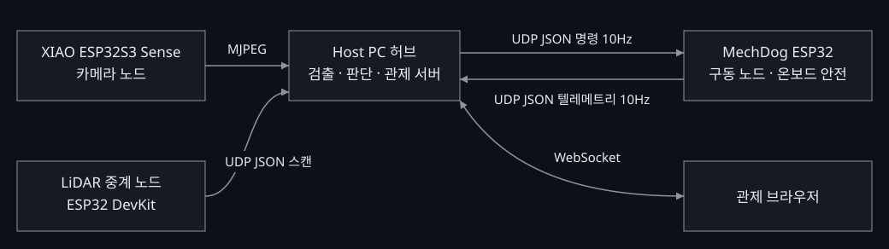
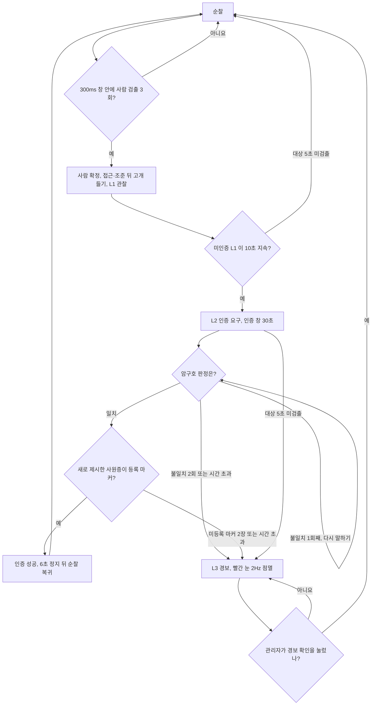

# MechDog Physical AI

야간 경비 순찰과 산업안전 점검을 4족 보행 로봇 한 대가 운용 모드로 나눠 수행하는 자율 순찰 시스템입니다.

[](https://github.com/PJW-1/mechadog/actions/workflows/ci.yml)

<!-- 사진 자리: docs/img/ 에 로봇 사진을 넣고 이 주석을 이미지로 바꾼다 -->

## 해결하려는 문제

야간 경비와 산업안전 점검은 사람이 정해진 경로를 반복해서 돌며 이상을 찾는 일입니다. 이 프로젝트는 그 반복 순찰과 1차 판단을 로봇에게 맡깁니다.
로봇은 순찰마다 **경비 모드**(침입자 확인·인증·경보)와 **공장 모드**(쓰러짐·넘어진 물건·막힌 통로 판독) 중 하나로 움직이며, 한 순찰에서 두 모드의 판단을 섞지 않습니다([ADR-33](docs/DECISIONS.md#adr-33)).
공장 모드 시연은 구역 A~D 를 같은 순서로 돌며 이동 중 막힘 우회, 화기 위험구역(C)의 위험물 경고, 쓰러진 사람과 보호구 판정을 한 바퀴에 보여 줍니다([시연 시나리오](docs/features/factory-demo-scenario.md)).
사람은 로봇이 올린 경보를 관제 화면에서 확인하고 해제할 때, 그리고 비상정지를 누를 때 개입합니다. 최고 단계 경보(L3)와 페일세이프는 로봇이 스스로 풀지 않습니다.

## 시스템 구성과 역할 분담

Hiwonder MechDog(ESP32) 위에 Seeed XIAO ESP32S3 Sense 카메라와 Host PC 를 결합하고, 제조사 모션 라이브러리를 HAL 로 삼아 그 위에 인지 → 판단 → 행동 스택을 새로 얹은 팀 프로젝트입니다.

팀은 다음과 같이 역할을 나누어 개발합니다.

| 역할 | 담당 범위 |
| :--- | :--- |
| **시스템·통합** | 요구사항·통신 프로토콜·설계 문서, 호스트 인지·판단 로직, 관제 서버, 테스트·CI |
| **임베디드·하드웨어** | 모션 펌웨어, 온보드 안전 로직, LiDAR 중계 노드, 하드웨어 연결·검증 |
| **인지·AI** | PPE(보호구) 검출 모델 개발·검증 |

세부 작업과 담당자 배정은 [담당자별 작업 목록](docs/internal/ASSIGNMENTS.md)을 참고하세요.

**하드웨어 구성**

| 노드 | 장비 | 역할 |
| :--- | :--- | :--- |
| 구동 | Hiwonder MechDog: ESP32, 코어리스 서보 8개, IMU, 초음파 | 보행, 온보드 안전 판정 |
| 카메라 | Seeed XIAO ESP32S3 Sense: OV3660, 8MB PSRAM | VGA MJPEG 송출 |
| 호스트 | Windows 11 PC: RTX 3080 10GB, i7-10700K, RAM 32GB | 추론, 판단, 관제 서버 |
| 측위 | FHL-LD19 2D LiDAR + ESP32 DevKit 중계 | 지도 작성과 구역 순찰용 스캔 |

## 시스템 아키텍처

노드끼리는 선으로 잇지 않고 Host PC 를 허브로 두는 스타 구조입니다. 로봇 위의 노드는 각자 전원을 가지며 Host 와만 무선으로 통신합니다.



**온보드 안전(Tier 1)과 Host 판단(Tier 2)을 나눈 이유**

- 링크 두절·저전압·장애물 정지처럼 늦으면 사고가 나는 판단은 로봇 펌웨어가 합니다. Host 가 꺼져도 로봇은 스스로 멈춥니다.
- 사람 확인·인증·경보처럼 모델과 문맥이 필요한 판단은 GPU 가 있는 Host 가 합니다. 로봇에서는 AI 추론을 하지 않습니다([ADR-3](docs/DECISIONS.md#adr-3)).
- Host 는 로봇이 보고한 래치를 따라갈 뿐 로봇의 안전 판정을 덮어쓰지 않습니다. 결정의 근거는 [대표 설계 결정](docs/design-decisions.md)에 정리했습니다.

### 대표 판단 흐름: 경비 모드에서 사람을 만났을 때



분기와 수치는 [`config/config.yaml`](config/config.yaml)의 `detect_window_ms`·`detect_hits_required`·`l1_to_l2_hold_s`·`auth` 절과 같습니다. 판정이 늦게 도착하는 경우의 인증 창 연장 같은 세부 분기는 [사람 확인·추적](docs/features/person-tracking.md), [경비 모드 인증](docs/features/guard-auth.md), [대응 에스컬레이션](docs/features/escalation.md)에 있습니다.

## 핵심 기술

### 1. 실시간 제어와 안전

- Host 는 변화가 없어도 명령을 10Hz 로 고정 송신하고, 로봇은 텔레메트리를 10Hz 로 보고합니다([PROTOCOL.md](docs/PROTOCOL.md)).
- 로봇은 마지막 유효 명령 뒤 600ms 동안 다음 명령이 없으면 스스로 페일세이프로 래치합니다. 처음 값인 300ms 에서 무선 구간 지연 때문에 래치가 반복되는 것을 실측으로 확인하고 옮긴 값입니다([ADR-39](docs/DECISIONS.md#adr-39), [사례 1](docs/case-studies/01-command-timeout.md)).
- 페일세이프 해제는 사람이 해제를 누르고 로봇이 `safety_latched=false` 를 보고해야만 끝납니다. Host 가 보낸 값을 되돌려 받는 `state` 는 판단에 쓰지 않습니다([ADR-21](docs/DECISIONS.md#adr-21), [사례 3](docs/case-studies/03-echoed-state-self-lock.md)).
- E-Stop 명령은 다른 모든 조건보다 우선해 로봇을 래치합니다([제어 링크와 페일세이프](docs/features/failsafe.md)).
- 초음파가 25cm 미만을 연속 2표본 읽으면 로봇이 전진을 멈춥니다. 이 반사 정지는 래치가 아니어서 전방이 비면 로봇이 스스로 풉니다([순찰 중 장애물 대응](docs/features/patrol-obstacle.md)).

### 2. 비전·ML 파이프라인

- 사람 검출은 YOLOX-S(Apache-2.0)를 ONNX Runtime DirectML 로 돌립니다. 검출기 계열은 배포 라이선스를 기준으로 골랐습니다([ADR-24](docs/DECISIONS.md#adr-24), [models/README.md](models/README.md)).
- 사람 확정은 연속 프레임 수가 아니라 300ms 고정 시간 창 안의 검출 횟수로 셉니다. 프레임 수로 정하면 추론률이 바뀔 때 오검출 억제 강도와 확인 지연이 함께 바뀌기 때문입니다([ADR-25](docs/DECISIONS.md#adr-25), [사례 2](docs/case-studies/02-person-gate-time-window.md)).
- 추적은 IoU 로 ID 를 잇고, 박스 높이와 초음파 거리로 정지선을 정한 뒤 가로 편차로 정면을 맞춥니다([사람 확인·추적](docs/features/person-tracking.md)).
- 스트림 수신과 추론은 제어 루프와 분리되어 있고, 추론이 밀리면 오래된 프레임을 버립니다([비전 스트림](docs/features/vision-stream.md)).
- 검출기가 말할 수 없는 장면(쓰러진 사람, 막힌 통로)은 로컬 VLM(Qwen2-VL-2B-Instruct)에 닫힌 질문으로 한 장씩 묻습니다. VLM 이 늦거나 실패해도 주행은 막히지 않습니다([VLM 단일 장면 판독](docs/features/vlm-reading.md)).
- PPE(보호구) 검출은 개발 중입니다.

### 3. 백엔드와 관측성

- FastAPI 관제 서버가 WebSocket 으로 여러 화면에 10Hz 상태를 보내고, 수동 조작과 비상정지를 받습니다([DASHBOARD.md](docs/DASHBOARD.md)).
- 사건 블랙박스는 사건 당시의 JPEG, 판단 근거, 텔레메트리를 로그와 따로 보관합니다. 완성된 메타데이터가 없는 기록은 피드에 보이지 않습니다([`host/common/blackbox.py`](host/common/blackbox.py)).
- 로그는 JSON Lines 구조화 로그이며, 샘플 로그를 테스트가 대조합니다([ENGINEERING_GUIDE.md](docs/ENGINEERING_GUIDE.md)).
- 가상 로봇(`tools/mock/mock_mechdog.py`)은 명령을 받고 텔레메트리를 응답하며 장애를 주입할 수 있어, 하드웨어 없이 런타임과 관제 화면을 재현합니다([tools/README.md](tools/README.md)).

## 성능 수치와 측정 조건

표에는 저장소 안에 원문 기록이 있는 수치만 넣었습니다. 기준 PC 는 RTX 3080·i7-10700K 이고, 실기는 `mechdog-01` 과 XIAO ESP32S3 Sense(OV3660, VGA) 조합입니다.

| 항목 | 수치 | 조건 | 원문 |
| :--- | :--- | :--- | :--- |
| 검출기 처리 시간 | 평균 8.2ms, p95 8.6ms | 2026-09-10, 기준 PC·DirectML, 전처리부터 후처리까지, n=50, 잡음 프레임(속도만 측정) | [design-decisions §4](docs/design-decisions.md), [ADR-24](docs/DECISIONS.md#adr-24) |
| 사람 검출 신뢰도 | 0.89~0.92 | 2026-09-10 실기, 정면·밝은 조건, 거리 2~3m | [design-decisions §4](docs/design-decisions.md), [기준선 인용](field_tests/results/20260915_4.4.3-event-feed/summary.md) |
| 프레임 도착 → 검출 완료 | 평균 49.9ms → 24.4ms | 2026-09-10 실기, 같은 스트림에서 추론률 10fps 와 25fps 비교 | [ARCHITECTURE.md](docs/ARCHITECTURE.md) |
| PC ↔ 로봇 UDP 왕복 | 평균 3.2ms, 최대 15.4ms, 손실 0% | 2026-09-09 실기, XIAO VGA 25fps 200프레임을 수신하는 동안 | [ADR-23](docs/DECISIONS.md#adr-23) |
| 텔레메트리 수신률 | 10.00Hz (30초에 새 `seq` 300건) | 2026-09-17, `mechdog-01`, 반복된 값이 아니라 새 `seq` 로 계수 | [G1 검수 기록](field_tests/results/20260917_6.4.1-g1/summary.md) |
| 카메라 → 판단 → 정지 명령 | 최소 81ms, 최대 121ms (예산 250ms) | 2026-09-15, `mechdog-01`, 사슬을 끝까지 확정한 프레임 4장 | [E2E 측정](docs/measurements/2026-09-15-e2e-chain.md) |
| 관제 화면 FPV | 22.62fps (272장 / 11.982초) | 2026-09-15, 검출 박스 포함 브라우저 WebSocket, 순서 역전·JPEG 오류 0건 | [DECISIONS.md](docs/DECISIONS.md) |
| 초음파 반사 정지 | 9/9 통과, 상태 떨림 29회 → 0회 | 2026-09-17, `mechdog-01` 받침대 시험, 21cm 장애물, 해제 조건 수정 전후 비교 | [반사 정지 실측](field_tests/results/20260917_3.2.6-obstacle-stop/summary.md) |

## 실제 시연

시연 영상: 준비 중입니다.

<!-- 대시보드 화면 자리: docs/img/ 에 관제 화면 캡처를 넣고 이 주석을 이미지로 바꾼다 -->

**로봇 없이 5분 안에 보기**

```sh
pip install -r requirements.txt
python tools/mock/mock_mechdog.py --device mechdog-01
python -m host.runtime --device mechdog-01 --robot-ip 127.0.0.1 --no-vision --dashboard-port 8000
```

둘째 줄은 가상 로봇을 띄우고, 셋째 줄은 카메라 없이 런타임과 관제 서버를 띄웁니다. 이 두 명령은 서로 다른 터미널에서 실행하고 http://127.0.0.1:8000/ 을 엽니다(흰색 관제 화면 `/glass-preview/` 로 갑니다 — 검정 화면 `/index.html` 은 구버전). 가상 로봇은 실제 로봇처럼 안전 잠금(FAILSAFE)이 걸린 채 켜지므로, 움직이려면 먼저 관제 화면의 «안전 해제 (RESET_SAFE)» 를 누릅니다. 실제 로봇에 연결한 상태에서는 관제 화면의 수동 조작이 로봇을 움직입니다.

## 해결한 어려운 문제

- [명령 타임아웃 300ms → 600ms](docs/case-studies/01-command-timeout.md): Host 는 제때 보냈지만 무선 구간 지연으로 로봇이 스스로 래치한 원인을 시리얼 로그로 확정했습니다.
- [10fps 추론이 진짜 검출의 절반 이상을 놓친 문제](docs/case-studies/02-person-gate-time-window.md): 실기 343프레임을 분석해 추론률과 판정 방식을 함께 바꿨습니다.
- [반향된 상태값 때문에 Host 가 스스로를 잠글 수 있었던 문제](docs/case-studies/03-echoed-state-self-lock.md): 반향되지 않는 플래그만 판단에 쓰도록 바꿨습니다.
- [로봇 I²C 경유 음성 파형 중계가 불가능했던 사례](docs/case-studies/04-i2c-voice-relay.md): 브리지를 직접 읽고 써서 한계를 확인하고 듣기와 말하기 경로를 나눴습니다.

**더 읽기**

- [코드 읽는 순서](docs/code-tour.md): 처음 코드를 열 때 어느 파일부터 볼지와 5분 안에 목업으로 돌려 보는 방법입니다.
- [문서 색인](docs/README.md)
- [기능별 판단 흐름도 9건](docs/features/)
- [대표 설계 결정](docs/design-decisions.md)
- [설계 결정 기록(ADR 42건)](docs/DECISIONS.md)
- [실기 시험 기록](field_tests/README.md)

## 개발 방식

- **테스트**: 하드웨어 없이 도는 pytest 3,162건(86개 파일, 2026-09-29 기준)이 FSM 전이, 패킷 파싱, 안전 판정을 검사합니다. CI 는 `host`·`tools` 커버리지 80% 미만이면 실패합니다.
- **CI 게이트**: [`ci.yml`](.github/workflows/ci.yml)이 ruff 린트·포맷, pytest, 펌웨어 3종 arduino-cli 빌드와 펌웨어 정적 분석을 PR 마다 돌립니다.
- **문서·코드 일치 검사**: [ARCHITECTURE.md](docs/ARCHITECTURE.md)의 상태 전이표와 코드의 전이표가 같은지를 테스트가 대조하고([`tests/test_fsm.py`](tests/test_fsm.py)), 작업 목록 생성 결과가 원본과 같은지(`wbs_assignments.py --check`)와 문서 상대 링크가 실제 파일을 가리키는지(`check_doc_links.py`)를 CI 가 확인합니다.
- **커밋과 리뷰**: 커밋은 Conventional Commits 규약을 따르고, 변경은 PR 로 검토해 병합합니다(병합된 PR 335건, 2026-09-29 기준).
- **라이선스**: 저장소 코드는 [Apache-2.0](LICENSE)입니다. 검출 모델 가중치는 저장소에 넣지 않고 `python tools/fetch_models.py` 로 받으며, 출처와 라이선스는 [models/README.md](models/README.md)에 있습니다. 제조사 모션 라이브러리는 라이선스 표기가 없어 저장소에 넣지 않습니다([ADR-20](docs/DECISIONS.md#adr-20)).
