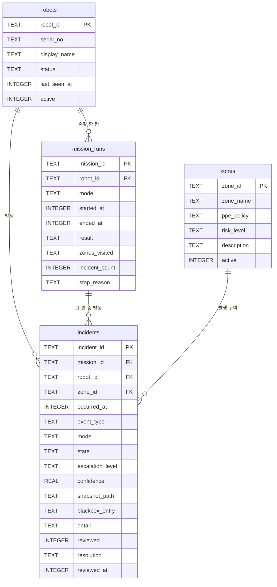

# 데이터 모델 · 사건 이력 DB

> 결정 근거는 [ADR-46](DECISIONS.md#adr-46), 요구사항은 [PRD FR-4.8](internal/PRD_Physical_AI_Guard_Robot.md), 작업은 WBS `4.6.6`·`4.6.7` 이다.
> 상태: **구현 중** (2026-10-06). 1단계(DB 모듈·런타임 기록·조회 API·블랙박스 가져오기 도구)를 진행하고, 웹 «이력» 화면은 2단계(`4.6.7`)다.

## 1. 목적

관제 대시보드는 지금 실시간 상태와 메모리에 든 최근 사건 64건만 보여 주고, 재시작하면 모두 사라진다. 웹에서 지난 사건과 순찰 이력을 찾아 보고 검토 결과를 남기려고, 사건과 순찰 한 판(`mission_run`)을 **SQLite 한 파일**에 색인으로 쌓는다.

- 엔진은 파이썬 표준 `sqlite3` 이다(새 의존성 없음). 파일 위치는 설정 `logging.history_db`(기본 `history/mechdog.sqlite3`, git 제외)다. WAL 모드와 외래키 검사를 켠다.
- 구현은 `host/common/history.py` 의 `HistoryStore` 다.
- **DB 는 색인이지 원본이 아니다.** 그림과 판정 원문의 정본은 블랙박스 폴더이고, DB 는 `tools/ops/history_import.py` 로 블랙박스에서 다시 만들 수 있다.
- DB 쓰기가 실패하면 `history_write_failed` 로 기록만 하고 10 Hz 제어 루프는 멈추지 않는다(블랙박스 쓰기와 같은 규칙).
- 시각은 모두 **epoch 밀리초(Host PC 시계)** 다.

## 2. 관계도



추가로 `schema_meta(key, value)` 표가 스키마 버전(`1`)을 담는다.

## 3. 표별 필드

### 3.1 `robots` · 로봇

| 필드 | 형식 | 뜻 | 출처 |
| :--- | :--- | :--- | :--- |
| `robot_id` | TEXT PK | 로봇 식별자(예 `mechdog-02`) | 설정 `device_id` |
| `serial_no` | TEXT | 하드웨어 식별자(MAC 기반) | 텔레메트리 `telemetry_device_id` |
| `display_name` | TEXT NOT NULL | 화면 표시 이름. 지금은 `device_id` 와 같다 | 설정 `device_id` |
| `status` | TEXT | 마지막으로 본 FSM 상태 | 런타임 FSM 상태 |
| `last_seen_at` | INTEGER | 마지막으로 받아들인 텔레메트리 시각. **5초에 한 번 이하**로 쓴다 | 텔레메트리 수신 시각 |
| `active` | INTEGER | 사용 중이면 1, 아니면 0. 기본 1 | 기본값 |

### 3.2 `zones` · 구역

| 필드 | 형식 | 뜻 | 출처 |
| :--- | :--- | :--- | :--- |
| `zone_id` | TEXT PK | 구역 이름표(`A`~`D`) | 설정 `zones.ids` |
| `zone_name` | TEXT NOT NULL | 구역 표시 이름. 정책에 이름이 없으면 `zone_id` | 설정 `zones.policies.<id>.name` |
| `ppe_policy` | TEXT NOT NULL | 요구 보호구. `helmet+vest` · `helmet` · `vest` · `none` 중 하나. 정책이 없는 구역은 `helmet+vest` | 설정 `zones.policies.<id>.helmet`·`vest` |
| `risk_level` | TEXT NOT NULL | `hazard`(위험구역) 또는 `normal` | 설정 `zones.hazard_ids` 에 있으면 `hazard` |
| `description` | TEXT | 구역 설명 | 설정 `zones.policies.<id>` 의 메모 |
| `active` | INTEGER | 사용 중이면 1, 아니면 0 | 기본값 |

### 3.3 `mission_runs` · 순찰 한 판

| 필드 | 형식 | 뜻 | 출처 |
| :--- | :--- | :--- | :--- |
| `mission_id` | TEXT PK | `<robot_id>-<started_at>` | 런타임이 만든다 |
| `robot_id` | TEXT NOT NULL FK | 순찰한 로봇 | `robots.robot_id` |
| `mode` | TEXT NOT NULL | 운용 모드 `guard` 또는 `factory` | 런타임 운용 모드 |
| `started_at` | INTEGER NOT NULL | 시작 시각 | FSM 전이 시각 |
| `ended_at` | INTEGER | 끝난 시각. 진행 중이면 NULL | FSM 전이 시각 |
| `result` | TEXT | 진행 중 NULL, 끝나면 `stopped` · `manual` · `failsafe` · `shutdown` · `interrupted` | 5절 |
| `zones_visited` | TEXT | 구역 id 의 JSON 배열(처음 도착한 순서) | ZoneInspector 앵커 도착 |
| `incident_count` | INTEGER | 그 판에 쌓인 사건 수 | `incidents` 집계 |
| `stop_reason` | TEXT | 끝낸 FSM 트리거 이름(`ESTOP` · `LINK_LOST` · `MANUAL_ON` 등) 또는 `runtime_stopped` | FSM 전이 |

### 3.4 `incidents` · 사건

| 필드 | 형식 | 뜻 | 출처 |
| :--- | :--- | :--- | :--- |
| `incident_id` | TEXT PK | 블랙박스 사건은 `<robot_id>_<폴더 이름>`(여러 대는 폴더를 로봇마다 나누므로, 같은 밀리초에 같은 사건을 남긴 두 로봇의 폴더 이름이 같을 수 있다), 그 밖의 사건은 `<ts_ms>_<event>_<8자리 16진수>` | 기체 ID 와 블랙박스 폴더 이름, 또는 런타임 |
| `mission_id` | TEXT FK NULL | 속한 순찰 판. 열린 판이 없을 때 발생했으면 NULL | `mission_runs.mission_id` |
| `robot_id` | TEXT NOT NULL FK | 사건이 난 로봇 | `robots.robot_id` |
| `zone_id` | TEXT FK NULL | 사건 구역. 판정의 `zone`, 없으면 로봇이 그때 있던 구역, 그것도 없으면 NULL | 판정 `judgement.zone` · ZoneInspector |
| `occurred_at` | INTEGER NOT NULL | 발생 시각 | 사건의 `ts_ms` |
| `event_type` | TEXT NOT NULL | 사건 종류(4절) | 사건의 `event` |
| `mode` | TEXT | 그때의 운용 모드 | 사건의 `mode` |
| `state` | TEXT | 그때의 FSM 상태 | 사건의 `state` |
| `escalation_level` | TEXT | `L0`~`L3` 또는 `F` | 사건의 `escalation` |
| `confidence` | REAL NULL | 검출·추적 점수의 최댓값 | 블랙박스 `detections`·`tracks` 의 `score` |
| `snapshot_path` | TEXT NULL | `<폴더>/snapshot.jpg`(블랙박스 폴더 기준 상대 경로) | 블랙박스 |
| `blackbox_entry` | TEXT NULL | 블랙박스 폴더 이름 | 블랙박스 |
| `detail` | TEXT | 판정 원문 또는 추가 필드(`warning` · `reason` · `previous` · `trigger` 등)의 JSON | 블랙박스 `judgement` 또는 피드 사건 |
| `reviewed` | INTEGER | 검토했으면 1. 기본 0 | 관제 화면 검토 |
| `resolution` | TEXT | 처리 메모(최대 2000자). 기본 빈 문자열 | 관제 화면 검토 |
| `reviewed_at` | INTEGER NULL | 검토 시각 | 관제 화면 검토 |

### 3.5 색인

`incidents(occurred_at)` · `incidents(zone_id, occurred_at)` · `incidents(event_type, occurred_at)` · `incidents(mission_id)` · `mission_runs(robot_id, started_at)`.

### 3.6 처음 제안에서 더한 열

`incidents.state` · `incidents.blackbox_entry` · `incidents.detail` · `incidents.reviewed_at` 과 `schema_meta` 표를 더했다. 실제로 남는 데이터(블랙박스 폴더, FSM 상태, 판정 원문)에 맞추려는 것이다.

## 4. 사건 종류

**관제 사건 피드에 뜨는 사건은 모두 DB 에도 남는다.** 대시보드를 켜지 않고 런타임만 돌려도 기록한다.

블랙박스 장면이 있는 사건(그림이 있다):

| `event_type` | 뜻 | 낸 곳 |
| :--- | :--- | :--- |
| `person_found` | 사람 검출이 확정됐다 | `host/runtime.py` |
| `person_fallen` | 쓰러짐이 확정됐다(의심 뒤 VLM «예» 연속) | `host/behavior/fall_monitor.py` |
| `zone_reading` | 구역 도착 때 VLM 이 읽은 결과 | `host/behavior/zone_inspector.py` |
| `hazard_notice` | 위험물 확인 가벼운 경고(검출기·VLM) | `host/behavior/zone_inspector.py` |
| `path_blocked` | 통로 막힘. LiDAR 확정 또는 VLM 판독 | `host/behavior/path_cause.py` · `zone_inspector.py` |
| `zone_changed` | 구역 안 넘어짐·무너짐 확정 | `host/behavior/zone_inspector.py` |
| `PPE_VIOLATION` | 보호구 미착용 판정 | `host/behavior/ppe_judge.py` |
| `PPE_UNDETERMINED` | 보호구 판정 불가 | `host/behavior/ppe_judge.py` |
| `PPE_SETTLED` | 보호구 적합 또는 경고 뒤 복귀 | `host/behavior/ppe_judge.py` |

피드에만 뜨는 사건(그림이 없다):

| `event_type` | 뜻 | 낸 곳 |
| :--- | :--- | :--- |
| `escalation_changed` | 에스컬레이션 단계 또는 래치가 바뀌었다 | `host/runtime.py` |
| `auth_required` | 인증이 필요해졌다 | `host/runtime.py` (FSM `AUTH_REQUIRED`) |
| `auth_granted` | 인증이 통과됐다 | `host/runtime.py` (FSM `AUTH_OK`) |
| `auth_failed` | 인증이 실패했다 | `host/runtime.py` (FSM `AUTH_FAILED`) |
| `failsafe_entered` | 페일세이프에 들어갔다 | `host/runtime.py` |
| `failsafe_cleared` | 페일세이프 래치를 풀었다 | `host/runtime.py` (FSM `RESET_CONFIRMED`) |
| `voice_auth_granted` | 암구호 인증이 통과됐다 | `host/behavior/voice_auth.py` |

## 5. 순찰 판(`mission_run`) 열고 닫는 규칙

- **연다:** FSM 이 대기·안전 상태 `{IDLE, MANUAL, FAILSAFE}` 를 떠나 다른 상태로 가는 순간. 보통 `START_PATROL` 로 `IDLE → PATROL` 이다.
- **닫는다:** 그 상태 중 하나로 다시 들어가는 순간, 또는 런타임이 멈출 때.
- `result`: `stopped`(IDLE 로 들어감) · `manual`(MANUAL) · `failsafe`(FAILSAFE) · `shutdown`(런타임 정상 종료) · `interrupted`(다음 기동 때 열린 채 발견됨, 예 비정상 종료).
- `stop_reason`: 닫은 FSM 트리거 이름 또는 `runtime_stopped`.
- `zones_visited`: 구역 도착(ZoneInspector 의 앵커 도착)을 처음 도착한 순서로 담는다.

## 6. 조회 API

모두 기존 로컬 출처 검사 아래에 있다(`127.0.0.1` 전용, 다른 출처는 403). 구현은 `host/dashboard/server.py` 의 `_history_routes` 다.

| 메서드 · 경로 | 뜻 · 응답 |
| :--- | :--- |
| `GET /api/history/incidents` | 사건 목록(최근 것부터). 필터 `since` · `until`(epoch ms, 양 끝 포함) · `robot` · `zone` · `event` · `escalation` · `mission` · `reviewed`, 쪽 `limit`(1~500, 기본 50) · `offset`. 응답 `{items, total, limit, offset}` |
| `GET /api/history/incidents/{incident_id}` | 사건 하나. 없으면 404 |
| `GET /api/history/runs` | 순찰 판 목록(최근 것부터). `robot` · `limit` · `offset`. 응답 `{items, total, limit, offset}` |
| `GET /api/history/robots` | 로봇 목록. 응답 `{items}` |
| `GET /api/history/zones` | 구역 목록. 응답 `{items}` |
| `POST /api/history/incidents/{incident_id}/review` | 검토 저장. 본문 `{reviewed: bool, resolution: str ≤ 2000자(기본 "")}`. 갱신된 사건을 돌려주고 없으면 404 |

- 오류 본문은 다른 관제 경로와 같은 `{"error": <사유>}` 다. 잘못된 본문은 400(사유는 첫 번째로 틀린 필드), 없는 사건은 404 `incident_not_found`, 저장소가 `sqlite3.Error` 를 내면 503 `history_unavailable`. 질의 매개변수의 형식 오류만 FastAPI 기본 422 다.
- `logging.history_db` 가 비어 저장소가 없으면 **경로는 남고 모두 503 `history_disabled`** — 화면이 «꺼짐» 과 «없음(404)» 을 가른다.
- ⚠️ 플릿(`host/fleet.py`)에서는 모든 기체의 앱이 같은 저장소 하나를 쓰므로 **어느 `/robots/<id>` 아래에서도 전 기체의 기록이 나온다.** 기체별은 `?robot=` 으로 거른다.
- 스냅샷은 새 경로를 만들지 않고 기존 `GET /events/{entry}/snapshot.jpg` 를 쓴다(사건의 `blackbox_entry`). 플릿에서는 블랙박스 폴더가 로봇마다 나뉘므로 사건의 `robot_id` 를 따라 `/robots/<robot_id>/events/<blackbox_entry>/snapshot.jpg` 를 부른다.

기존 블랙박스에서 DB 를 만들거나 되살릴 때(몇 번을 돌려도 같고, 이미 있는 사건과 검토 기록은 건드리지 않는다):

```
python tools/ops/history_import.py --device <unit-id> [--blackbox DIR] [--db PATH]
```

경로 기본값은 `logging.blackbox_dir` · `logging.history_db`. 플릿이 남긴 기록은 로봇마다 `<blackbox_dir>/<device>` 에 있으므로 `--blackbox` 로 그 폴더를 주고 기체마다 한 번씩 돌린다. 순찰 판은 블랙박스에 없어 복구되지 않는다.

## 7. DB 밖에 남는 데이터

| 데이터 | 위치 | 비고 |
| :--- | :--- | :--- |
| 블랙박스 폴더 | `<epoch_ms>_<event>/` 안의 `snapshot.jpg` · `meta.json` | **그림과 판정 원문의 정본.** 보관 정책은 아직 없다 |
| 구조화 로그(JSONL) | `logs/<device>.jsonl` | 10 MB 씩 5개 순환 |
| 설정 | `config/config.yaml` · `config/devices/*.yaml` · `local.yaml` | 구역 정책은 장치별 설정에 있다 |
| 지도·구역 좌표 | `maps/zones.json` | LiDAR 지도와 구역 앵커 |
| 현장 시험 원자료 | `field_tests/results/` | 시험 기록 |

## 8. 한계

- `zones` 표는 전역이지만 구역 정책은 장치별 `local.yaml` 에 있다. **마지막으로 기동한 런타임의 값이 이긴다.** 시연은 한 대(`mechdog-02`)로 한다.
- 보관·삭제 정책이 없다(블랙박스와 같다).
- 10 Hz 루프가 DB 쓰기로 늦어지지 않는지는 실기 확인이 남았다.
