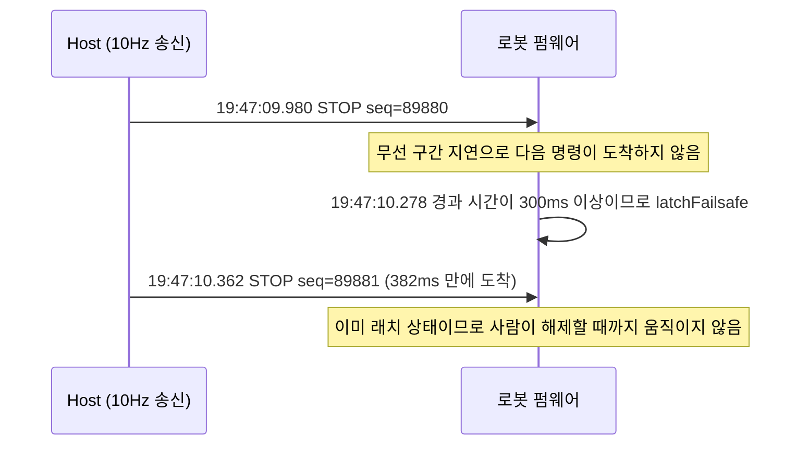

# 사례 1. 명령 타임아웃을 300ms 에서 600ms 로 늘린 결정

- 관련 결정: [ADR-39](../DECISIONS.md#adr-39)
- 대상: 로봇 온보드 명령 워치독(`kCommandTimeoutMs`)과 Host 설정 `safety.cmd_timeout_ms`

## 증상

로봇은 마지막 유효 명령을 받은 뒤 정해진 시간 안에 다음 명령이 오지 않으면 스스로 `FAILSAFE` 로 래치합니다. 2026-09-23 17:38 이후 `mechdog-01` 이 이 래치를 반복했고, 해제한 뒤 1초 안에 다시 걸린 경우도 있었습니다([ADR-39](../DECISIONS.md#adr-39)). Host 는 명령을 10Hz 로 보내고 있었으므로 워치독이 걸릴 이유가 없어 보였습니다.

## 가설과 배제

| 가설 | 확인한 내용 | 결론 |
| :--- | :--- | :--- |
| Host 가 명령을 늦게 보낸다 | 그 초의 Host 송신 간격 최댓값이 103ms 였습니다(`cmd_gap_ms_max`) | 배제합니다 |
| 패킷이 유실된다 | 로봇 시리얼에 찍힌 `seq` 가 끊기지 않았습니다 | 배제합니다. 유실이 아니라 지연입니다 |
| 보행이나 카메라 부하가 원인이다 | 로봇이 래치되어 서 있을 때도 ping 이 튀고, `--no-vision` 으로 카메라를 끊어도 재현됩니다 | 배제합니다 |
| 음성 모듈이 원인이다 | WonderEcho 모듈을 빼도 재현됩니다 | 배제합니다 |
| 로봇 Wi-Fi 절전이 원인이다 | 펌웨어가 이미 `WiFi.setSleep(false)` 로 절전을 끕니다 | 배제합니다 |

남는 가설은 로봇 쪽 2.4GHz 무선 구간의 지연 스파이크입니다. Host PC 는 유선으로 연결되어 있고 로봇만 무선입니다.

## 측정

USB 시리얼(`COM8`)로 로봇 로그를 받아 래치 사유를 확정했습니다(2026-09-23, `mechdog-01`, 출처는 [ADR-39](../DECISIONS.md#adr-39)).

```
19:47:09.980 CMD: seq=89880 STOP
19:47:10.278 FAILSAFE: command timeout >= 300 ms
19:47:10.362 CMD: seq=89881 STOP      ← 382ms 만에 도착
```

- 연속된 두 명령(`seq` 89880, 89881)의 도착 간격이 382ms 로 벌어졌고, 첫 명령 뒤 298ms 시점에 워치독이 걸렸습니다(로그 시각의 차이입니다).
- 로봇이 래치되어 정지한 상태에서 잰 ping 은 40회 평균 12ms, 최대 292ms 였습니다.



## 원인

Host 는 100ms 마다 명령을 보냅니다. 기준이 300ms 이면 연속한 두 주기만 늦어도 워치독이 걸립니다. 이 현장의 2.4GHz 링크는 수백 ms 단위의 지연 구간을 수시로 만들었고, 그 크기가 300ms 기준과 겹쳤습니다.

워치독 판정은 펌웨어의 [`mechdog_motion.ino` L879-L883](../../firmware/mechdog_motion/mechdog_motion.ino#L879-L883) 에서 이루어집니다. 유효 명령을 받은 적이 있고 래치가 걸려 있지 않을 때, 마지막 유효 명령 이후 경과 시간이 `kCommandTimeoutMs` 이상이면 `latchFailsafe` 를 호출합니다.

## 수정

- 펌웨어 상수 [`kCommandTimeoutMs = 600`](../../firmware/mechdog_motion/mechdog_motion.ino#L71) 과 설정 [`safety.cmd_timeout_ms: 600`](../../config/config.yaml#L63) 을 함께 600ms 로 올렸습니다.
- 설정 로더의 상한도 600 으로 옮겼습니다. 로더는 600 을 넘는 값, 링크 두절 페일세이프(3000ms) 이상인 값, 송신 주기 이하인 값을 기동 전에 거부합니다([`host/common/config.py` L261-L272](../../host/common/config.py#L261-L272)).
- 링크 두절 3초 페일세이프와 «명령 정지가 링크 페일세이프보다 먼저 동작한다» 는 순서 제약은 바꾸지 않았습니다.
- Host 는 운용 중에 틱 간격 최댓값(`cmd_gap_ms`)과 타임아웃을 넘은 간격의 횟수(`cmd_gap_over_timeout`)를 초당 요약에 싣습니다([`host/runtime.py` L1927-L1931](../../host/runtime.py#L1927-L1931)). 이 값으로 Host 가 늦었는지 링크가 늦었는지를 Host 로그만 보고 먼저 가를 수 있습니다.

검토했지만 채택하지 않은 대안은 두 가지입니다. 송신을 20Hz 로 올리는 방법은 지연이 한 패킷이 아니라 수백 ms 구간 단위로 오기 때문에 효과가 없습니다. 공유기 채널이나 위치를 바꾸는 방법은 시연장마다 조건이 달라서 통제할 수 없습니다.

## 검증

단위 테스트는 다음을 확인합니다.

- 기본 설정의 `cmd_timeout_ms` 가 600 이고, 0 초과 600 이하이며, 링크 두절 페일세이프보다 짧은지 확인합니다([`tests/test_config.py` L86](../../tests/test_config.py#L86), [L142](../../tests/test_config.py#L142), [L137](../../tests/test_config.py#L137)).
- 목업 로봇이 이동 명령 뒤 601ms 에 LED 명령만 받으면 이전 이동을 재개하지 않고 정지 상태를 유지하는지 확인합니다([`tests/test_runtime_safeguards.py` L110](../../tests/test_runtime_safeguards.py#L110)).
- 목업 로봇이 설정된 타임아웃이 지나면 펌웨어처럼 곧바로 래치하고, `RESET_SAFE` 전까지 `MOVE` 를 거부하는지 확인합니다([`tests/test_safety.py` L103](../../tests/test_safety.py#L103), [L149](../../tests/test_safety.py#L149)).

실기에서는 600ms 펌웨어를 올린 `mechdog-01` 로 같은 날 21:21 부터 21:39 까지 경비 대응 시험 다섯 판을 진행했습니다([실기 기록](../../field_tests/results/20260923_patrol-engage/summary.md)).

## 남은 한계

- 송신이 실제로 멈췄을 때 로봇은 마지막 보행 명령으로 최대 0.6초를 걷습니다. 300ms 일 때보다 0.3초 늘었습니다. 보폭 60mm, 약 3.3걸음/s 기준으로 최대 약 12cm, 이전보다 약 6cm 를 더 나갑니다. 온보드 장애물 정지(당시 25cm, 2026-10-06 부터 7cm · [ADR-47](../DECISIONS.md#adr-47))와 사람의 비상정지는 그대로 동작합니다([ADR-39](../DECISIONS.md#adr-39)).
- 600ms 로 바꾼 뒤의 실기 기록은 경비 대응 동작을 판정한 것이고, 무선 지연 래치의 재발 횟수를 따로 세지 않았습니다. 600ms 에서의 재발률은 아직 정량 근거가 없습니다.
- 이 값은 사람이 늘 곁에서 감시하는 시연·개발 운용을 전제로 합니다. 무인 운용으로 넓히면 값을 더 늘리지 않고 전용 AP, 5GHz, 유선 중계처럼 링크 품질을 먼저 개선하기로 정했습니다([ADR-39](../DECISIONS.md#adr-39)).
