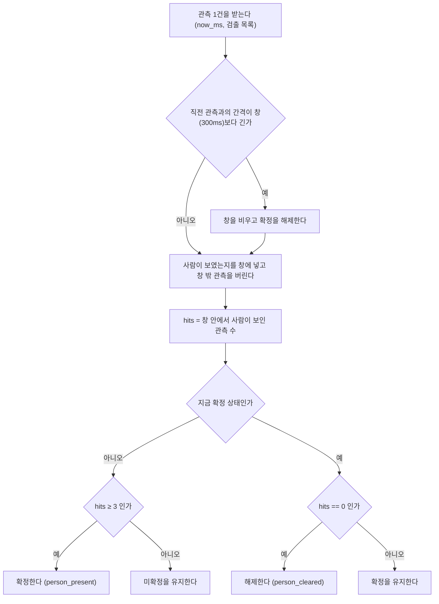

# 사례 2. 10fps 추론이 진짜 사람 검출의 절반 이상을 놓친 문제

- 관련 결정: [ADR-23](../DECISIONS.md#adr-23), [ADR-25](../DECISIONS.md#adr-25)
- 대상: 사람 판정 게이트 [`PersonGate`](../../host/vision/person.py#L212), 설정 `vision.inference_fps` · `vision.detect_window_ms` · `vision.detect_hits_required`

## 증상

카메라(XIAO)는 프레임을 25fps 로 보내고, Host 는 그중 일부만 골라 사람 검출을 돌립니다. 처음에는 GPU 부하와 FSM 10Hz 틱을 기준으로 추론률을 10fps 로 정했고, 사람 확정 조건은 «연속 3프레임» 이었습니다([ADR-23](../DECISIONS.md#adr-23)). 이 설정에서 수신 프레임의 60% 가 버려졌습니다(큐 드롭 185건/20초). 부하 계산으로는 문제가 없어 보였지만, 실기 343프레임을 분석하자 10fps 가 진짜 검출 구간 10개 가운데 4개만 확정한다는 것이 드러났습니다.

## 가설과 배제

| 가설 | 확인한 내용 | 결론 |
| :--- | :--- | :--- |
| 추론 시간이 모자라 프레임을 버린다 | YOLOX-S 는 기준 PC(RTX 3080, DirectML)에서 평균 8.2ms, p95 8.6ms 입니다(n=50, [ADR-24](../DECISIONS.md#adr-24)). 25fps 로 돌려도 부하는 20.5% 입니다 | 연산 여유는 원인이 아닙니다 |
| 검출기가 사람을 못 본다 | 짧은 검출 구간도 임계 0.5 를 넘는 프레임으로 원자료에 남아 있습니다 | 검출기 문제가 아닙니다 |
| 추론률이 짧은 검출 구간을 건너뛴다 | 아래 측정에서 추론률별 인정 개수가 달라집니다 | 원인으로 확인됩니다 |

설계 쪽 원인도 함께 드러났습니다. «연속 3프레임» 은 프레임 수로 정의되어 있어서 의미가 추론률에 종속됩니다. 같은 3프레임이 7fps 에서는 429ms, 25fps 에서는 120ms 입니다. 추론률을 바꾸면 오검출 억제 강도와 확인 지연이 함께 움직입니다.

## 측정

2026-09-10 실기에서 사람이 걸어서 왕복하는 장면을 25fps 로 343프레임 받았습니다. 사람 점수가 임계 0.5 를 넘은 프레임의 연속 구간 길이는 다음과 같습니다([ADR-25](../DECISIONS.md#adr-25)).

```
[52, 38, 29, 15, 12, 6, 6, 5, 3, 3,  1, 1, 1, 1, 1, 1, 1, 1]
 └──────── 진짜 10개 ────────┘  └─── 단발 8개 ───┘
```

3프레임 이상인 구간이 10개, 1프레임짜리 단발이 8개이고, 2프레임짜리 구간은 없습니다. 같은 원자료에서 추론률별로 «3회 검출» 조건을 적용한 결과는 다음과 같습니다.

| 추론률 | 진짜 구간 인정 | 단발 차단 | 추론 부하 |
| ---: | ---: | ---: | ---: |
| 10fps | 4 / 10 | 2 | 8.2% |
| 20fps | 8 / 10 | 5 | 16.4% |
| 25fps | 10 / 10 | 8 | 20.5% |

10fps 는 진짜 구간 10개 가운데 4개만 인정했습니다. [ADR-25](../DECISIONS.md#adr-25) 는 이 실기의 통과율을 52% 로 기록합니다.

## 원인

3~6프레임(120~240ms) 길이의 짧은 검출 구간이 프레임 건너뛰기로 사라졌습니다. 20fps 에서 놓친 두 구간은 120ms 짜리였습니다. 3회를 채우려면 관측이 3개 들어가야 하는데 50ms 간격으로는 2개만 들어갑니다([`config/config.yaml` L448-L450](../../config/config.yaml#L448-L450)). 여기에 «연속» 조건이 겹쳐서, 중간에 한 프레임만 빠져도 확인이 처음부터 다시 시작되었습니다.

## 수정

두 가지를 함께 바꿨습니다([`config/config.yaml` L432-L433, L453](../../config/config.yaml#L432-L453)).

- 추론률을 수신률과 같은 25fps 로 올려 프레임을 버리지 않습니다.
- 확정 조건을 «300ms 창 안에서 3회 검출» 로 바꿉니다. 연속을 요구하지 않고, 창이 완전히 비었을 때만 확정을 해제합니다.

게이트의 판단 흐름은 [`PersonGate.observe`](../../host/vision/person.py#L235-L280) 와 같습니다.



시간 창으로 바꾸면 설정 조합에 따라 영원히 확정되지 않는 경우가 생깁니다. 예를 들어 5fps(200ms 주기)에서는 300ms 창에 양 끝을 포함해 최대 2회만 들어가므로 3회 조건을 채울 수 없습니다. 이 한계는 추론률과 창 길이가 함께 정하기 때문에 한쪽 값만 봐서는 잡히지 않습니다. 그래서 설정 로더가 `floor(창 / 주기) + 1` 로 창 안의 최대 관측 수를 계산하고, 필요한 히트 수가 그보다 크면 기동 전에 `ConfigError` 로 거부합니다([`host/common/config.py` L164-L180](../../host/common/config.py#L164-L180)).

## 검증

단위 테스트([`tests/test_person_gate.py`](../../tests/test_person_gate.py))는 `now_ms` 를 직접 넣어 가상 시간으로 판정을 재현합니다.

- 실기 원자료의 구간 길이를 상수로 두고([L218](../../tests/test_person_gate.py#L218)), 단발 8개가 모두 막히는지([L221](../../tests/test_person_gate.py#L221))와 진짜 구간 10개가 모두 확정되는지([L237](../../tests/test_person_gate.py#L237)) 확인합니다. 두 번째 테스트는 `inference_fps` 를 낮추면 실패하도록 작성되어 있습니다.
- 7·10·15·20·25fps 에서 연속 검출이 창 안에서 확정되는지 확인합니다([L91](../../tests/test_person_gate.py#L91)).
- 5fps 설정을 로더가 거부하는지([L109](../../tests/test_person_gate.py#L109)), 7fps(0·143·286ms)는 받아들이는지([L123](../../tests/test_person_gate.py#L123)) 확인합니다.

실기 검증은 다음과 같습니다([ADR-25](../DECISIONS.md#adr-25)).

- 같은 343프레임을 새 게이트에 통과시키면 원자료의 18개 구간(단발 8개 포함)이 41·72·73·14프레임 길이의 확정 구간 4개로 정리되고, 1~2프레임짜리 떨림은 나오지 않습니다.
- 실제 스트림으로 20초 운용하는 동안 `PATROL↔ALERT` 전이 6회를 확인했고, 틱 간격 최댓값은 101ms 였습니다.

## 남은 한계

- 시간 창은 히트를 인정할 최대 간격만 고정합니다. 필요한 히트 수가 횟수이므로 확인 지연은 여전히 추론률에 따라 달라집니다(7fps 286ms, 25fps 80ms). 25fps 도 이 결정의 일부이며, 값을 바꾸면 검출률과 오검출률을 다시 재야 합니다.
- 해제 후 200ms 만에 다시 확정된 사례가 한 번 있었습니다. 사람이 300ms 이상 실제로 사라졌다가 돌아온 경우라 게이트는 설계대로 동작했지만, 추종 동작에는 한 걸음의 왕복이 생깁니다.
- 근거 데이터는 한 장면 343프레임입니다. 역광 같은 악조건에서 통과율이 크게 떨어지면 `detect_hits_required` 를 2 로 내리는 방안을 검토하기로 했습니다([ADR-25](../DECISIONS.md#adr-25)).
- 저장소에는 343프레임 원본과 추론률별 표를 계산한 스크립트가 없고, 구간 길이 목록만 [ADR-25](../DECISIONS.md#adr-25) 와 테스트 상수로 남아 있습니다. 테스트가 고정하는 것은 현재 설정(25fps)의 결과뿐입니다.
