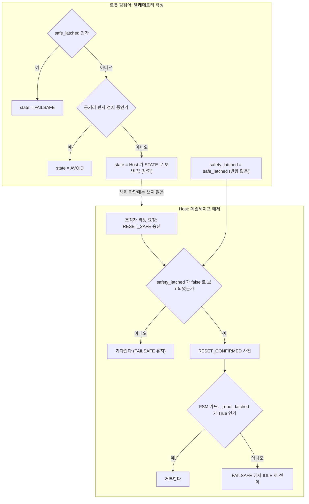

# 사례 3. 반향된 상태값 때문에 Host 가 스스로를 잠글 수 있었던 문제

- 관련 결정: [ADR-21](../DECISIONS.md#adr-21), [ADR-22](../DECISIONS.md#adr-22)
- 대상: Host FSM 의 페일세이프 해제 가드(`LATCH_GUARDED`), 텔레메트리의 `state` · `safety_latched` · `obstacle`

## 증상

이 사례는 두 번 나타났습니다. 첫 번째는 설계 검토에서, 두 번째는 목업 실행에서 드러났습니다.

1. **페일세이프 해제([ADR-21](../DECISIONS.md#adr-21))**: Host 가 `FAILSAFE` 를 떠날 때 로봇도 함께 풀렸는지 확인해야 합니다. 확인하지 않으면 조작자가 리셋을 누른 뒤 Host 만 `IDLE` 이 되고 로봇은 잠긴 채 남습니다. 로봇은 명령을 무시하므로 위험하지는 않지만 관제 화면이 실제와 다른 상태를 보여 줍니다. 같은 상태가 반복 보고되어도 사건은 다시 만들어지지 않으므로, 그 뒤 어떤 텔레메트리도 이 어긋남을 고치지 못합니다.
2. **회피 종료([ADR-22](../DECISIONS.md#adr-22))**: Host 는 로봇이 `AVOID` 를 벗어나 `PATROL` 을 보고하면 회피가 끝난 것으로 보았습니다. 단위 테스트는 통과했지만, 목업 상대 실행에서 회피 시퀀스가 3회 모두 돌고도 `AVOID` 를 빠져나오지 못했습니다. 후진으로 장애물이 실제로 멀어졌는데도 `state` 는 계속 `AVOID` 로 왔습니다.

## 가설과 배제

첫 번째 문제에 대해 가장 먼저 떠오른 해법은 «텔레메트리의 `state` 가 `FAILSAFE` 인 동안 `RESET_CONFIRMED` 를 막는다» 였습니다. 한 줄로 끝나고 새 필드도 필요 없습니다. 이 해법은 채택하지 않았습니다. 로봇 텔레메트리의 `state` 가 로봇 자신의 판정만 담는지 확인하자 그렇지 않았기 때문입니다.

## 측정

로봇 펌웨어가 텔레메트리의 `state` 를 채우는 규칙은 다음과 같습니다([`firmware_mechdog_motion.ino` L688-L690](../../firmware_mechdog_motion/firmware_mechdog_motion.ino#L688-L690)).

- 안전 래치가 걸려 있으면 `FAILSAFE` 를 보고합니다.
- 그렇지 않고 근거리 반사 정지가 걸려 있으면 `AVOID` 를 보고합니다.
- 둘 다 아니면 Host 가 `STATE` 명령으로 마지막에 알려 준 값을 그대로 되돌려 보냅니다([L520-L522](../../firmware_mechdog_motion/firmware_mechdog_motion.ino#L520-L522)).

Host 는 FSM 상태가 바뀔 때마다 `STATE` 명령으로 그 값을 로봇에 알립니다([`host/behavior/commander.py` L93-L103](../../host/behavior/commander.py#L93-L103)). `FAILSAFE` 와 `AVOID` 는 로봇이 스스로 판정하는 상태이면서 Host 가 `STATE` 로 내려보내는 상태이기도 합니다. 따라서 되돌아온 `state="FAILSAFE"` 나 `state="AVOID"` 만으로는 로봇의 판정인지 Host 가 보낸 값의 반향인지 구분할 수 없습니다.

두 번째 문제의 목업 실행 결과(회피 시퀀스 3회 후에도 `AVOID` 유지)는 이 구조가 실제로 문제를 일으킨다는 것을 보여 줍니다.

## 원인

Host 가 반향된 값을 판단 근거로 쓰면 자기 자신의 출력을 입력으로 다시 읽게 됩니다. `state` 로 해제를 막았다면 다음 순서로 Host 가 영구히 잠깁니다. 링크 두절로 Host FSM 이 `FAILSAFE` 에 들어가고, 그 값을 `STATE` 로 로봇에 알립니다. 링크가 돌아오고 로봇에는 래치가 없어도 로봇은 `FAILSAFE` 를 되돌려 보내므로 해제가 계속 거부됩니다. 회피 쪽도 같은 구조로 `AVOID` 에서 나오지 못했습니다.

## 수정

판단에는 반향되지 않는 값만 씁니다.

- **페일세이프 해제**: 로봇 펌웨어는 자체 래치를 `safety_latched` 로 따로 보고합니다([`firmware_mechdog_motion.ino` L706](../../firmware_mechdog_motion/firmware_mechdog_motion.ino#L706)). Host FSM 은 해제 사건 하나(`RESET_CONFIRMED`)만 가드하고, 가드는 이 값만 봅니다([`host/behavior/fsm.py` L206](../../host/behavior/fsm.py#L206), [L615-L616](../../host/behavior/fsm.py#L615-L616)). 안전 상태로 들어가는 사건(`ESTOP`, `ONBOARD_FAILSAFE`)은 막지 않습니다.
- **해제 절차**: 조작자가 리셋을 요청하면 Host 는 `RESET_SAFE` 를 보내고 기다립니다([`host/runtime.py` L2088-L2101](../../host/runtime.py#L2088-L2101)). 로봇이 `safety_latched=false` 를 보고한 뒤에야 `RESET_CONFIRMED` 를 적용합니다([L2365-L2372](../../host/runtime.py#L2365-L2372)).
- **회피 종료**: 텔레메트리에 `obstacle` 플래그를 더했습니다([`firmware_mechdog_motion.ino` L704](../../firmware_mechdog_motion/firmware_mechdog_motion.ino#L704)). Host 수신기는 이 플래그가 참에서 거짓으로 바뀔 때 `AVOID_CLEARED` 를 만듭니다([`host/telemetry/receiver.py` L168-L180](../../host/telemetry/receiver.py#L168-L180)). Host 는 거리값으로 직접 판정하지 않고 로봇이 보고한 플래그의 변화만 옮깁니다.

## 검증

- 반향된 `FAILSAFE` 가 Host 를 잠그지 않는지 확인합니다. 링크 두절로 Host 가 `FAILSAFE` 에 들어간 뒤 로봇이 `state="FAILSAFE"` 와 `safety_latched=false` 를 함께 보고하면 해제가 성공해야 합니다([`tests/test_fsm_guards.py` L90](../../tests/test_fsm_guards.py#L90)).
- 로봇 래치가 걸려 있으면 해제가 거부되고, 풀리면 허용되는지 확인합니다([L62](../../tests/test_fsm_guards.py#L62), [L79](../../tests/test_fsm_guards.py#L79)).
- 가드가 해제 사건 하나만 막는지, 비상정지는 어떤 가드에도 막히지 않는지 확인합니다([L52](../../tests/test_fsm_guards.py#L52), [L132](../../tests/test_fsm_guards.py#L132)).
- 런타임 수준에서 리셋 요청 뒤 로봇이 래치를 보고하는 동안은 `FAILSAFE` 에 머물고, `safety_latched=false` 가 온 뒤에 `IDLE` 로 가는지 확인합니다([`tests/test_runtime.py` L1031](../../tests/test_runtime.py#L1031)).
- 회피 쪽은 `state` 가 `AVOID` 로 계속 와도 `obstacle` 이 풀리면 해제되는지 확인합니다([`tests/test_telemetry_receiver.py` L296](../../tests/test_telemetry_receiver.py#L296)).

## 남은 한계

- 래치를 보고하지 않는 펌웨어에서는 FSM 가드가 해제를 막지 않습니다([`tests/test_fsm_guards.py` L112](../../tests/test_fsm_guards.py#L112)). 알 수 없는 값을 근거로 잠그면 해제 수단이 사라지기 때문입니다. 대신 운용 런타임의 해제 경로는 `safety_latched=false` 보고를 기다리므로([`host/runtime.py` L2367](../../host/runtime.py#L2367)), 그런 펌웨어에서는 리셋 요청이 완료되지 않습니다. 현재 펌웨어는 이 값을 항상 보고합니다.
- `obstacle` 플래그를 보내지 않는 펌웨어에서는 예전 규칙(`AVOID` 다음 `PATROL`)으로 돌아갑니다([`tests/test_telemetry_receiver.py` L340](../../tests/test_telemetry_receiver.py#L340)). 이 규칙은 Host 가 `AVOID` 를 `STATE` 로 알리지 않는 경우에만 동작합니다.
- 텔레메트리는 래치가 걸렸다는 사실만 알려 주고, 원인(전도, 저전압, 링크)을 나누어 보고하지 않습니다. 관제 화면은 무엇 때문에 잠겼는지 보여 주지 못합니다([ADR-21](../DECISIONS.md#adr-21)).
- 페일세이프 쪽 문제는 실기에서 재현된 적이 없고, 규칙을 검토하는 단계에서 발견했습니다. 실행 중에 드러난 것은 같은 구조의 회피 쪽 문제이며, 그것도 실기가 아니라 목업 상대 실행에서 드러났습니다.
