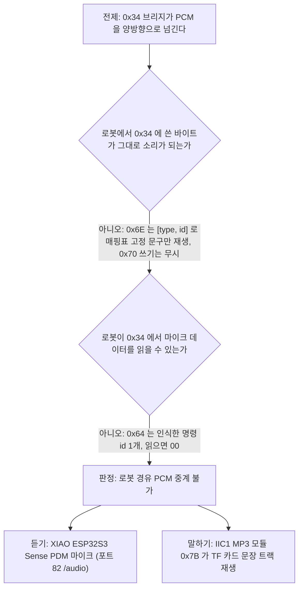

# 사례 4. 로봇 I²C 를 거친 음성 파형 중계가 실측으로 불가능했던 사례

- 관련 결정: [ADR-38](../DECISIONS.md#adr-38), [ADR-31](../DECISIONS.md#adr-31)
- 측정 기록: [0x34 브리지 투명성과 MP3 모듈 0x7B](../measurements/2026-09-23-bridge-transparency.md), [실기 요약](../../TEST_MECHDOG/results/20260923_4.7.9-bridge-transparency/summary.md)
- 시험 도구: [`i2c_bridge_probe.ino`](../../firmware_mechdog_motion/diagnostics/i2c_bridge_probe/i2c_bridge_probe.ino)

## 증상

음성 모듈(WonderEcho CI1302)은 USB 로 PC 에 연결되어 있었습니다. 이 구성은 케이블이 로봇을 PC 옆에 묶어 두므로 돌아다니는 로봇에서는 쓸 수 없습니다. 계획은 모듈을 로봇의 4핀 I²C 포트에 달고, 로봇이 모듈 마이크의 음성 파형(PCM)을 PC 로 보내고 PC 가 만든 응답 음성을 모듈 스피커로 되돌려 보내는 것이었습니다([ADR-38](../DECISIONS.md#adr-38)). 이 계획은 «로봇 쪽 I²C 브리지(`0x34`)가 임의 바이트를 그대로 넘긴다» 는 전제에 기대고 있었고, 그 전제는 확인된 적이 없었습니다.

## 가설과 배제

물음은 하나로 좁혔습니다. `0x34` 브리지가 임의 바이트를 그대로 넘기는지, 정해진 명령만 받는지를 확인합니다. 결과를 잘못 읽지 않도록 다음 경우를 먼저 배제했습니다.

| 오판 가능성 | 배제 방법 |
| :--- | :--- |
| 쓰기 뒤 무음이 모듈 고장 때문이다 | 무음이 나오면 바로 앞에서 재생되던 쓰기를 대조군으로 다시 넣어 모듈이 살아 있는지 확인합니다 |
| 포트를 잘못 골랐다 | 로봇 4핀 포트 가운데 `0x34` 가 보이는 포트는 IIC1 하나뿐입니다. 다른 포트에서는 `0x34` 가 보이지 않았습니다 |
| 스캔 범위 밖에 장치가 있다 | `0x08`–`0x7F` 전체를 훑습니다. `0x77` 에서 멈추면 예약 구간의 장치를 놓칩니다 |
| 읽기 실패를 전송 로그로 잘못 판정한다 | Arduino-ESP32 는 반복 시작 읽기에서 `tx` 를 늘 0 으로 찍으므로 판정은 실제로 받은 바이트 수(`got`)로 합니다 |

## 측정

2026-09-23 18:15–18:50, `mechdog-01`, 로봇 IIC1 포트(SDA22/SCL23, 100 kHz)에서 진단 스케치로 버스를 직접 읽고 썼습니다. 스케치는 app0 에만 올렸고, 시험 뒤 백업한 원래 펌웨어로 되돌려 쓰기 해시가 일치하는 것을 확인했습니다.

| 시험 | 동작 | 결과 |
| :--- | :--- | :--- |
| T0 | 대기 중 `0x34` 레지스터 `0x00`–`0xFF` 전부 읽기 | 전부 `00` |
| T1c, T1d | `0x6E` ← `FF 05`, `FF 01` | 매핑표의 고정 문구 "Obstacle ahead", "Recyclable waste" 가 재생됩니다 |
| T2 | `0x70` ← `FF 05` 두 번 | 무음입니다. 바로 뒤 대조군 `0x6E` ← `FF 05` 는 다시 재생됩니다 |
| T3 | "Hello Hiwonder", "Sit down" 발화 뒤 `0x64` 읽기 | 첫 읽기는 `0C`(SIT-DOWN), 이후는 `00` 입니다. 읽으면 지워지는 우편함입니다 |
| 스캔 | 모듈을 MP3 모듈로 교체 | IIC1 에 `0x6A`(IMU), `0x77`(초음파), `0x7B`, `0x7E` 가 보입니다 |

1바이트 읽기는 약 462 µs, 4바이트 읽기는 약 790 µs 걸렸습니다. 이 버스는 IMU 와 초음파가 함께 쓰는 안전 버스입니다([측정 기록 3절](../measurements/2026-09-23-bridge-transparency.md)).

## 원인

`0x34` 브리지는 데이터 통로가 아니라 명령 수준의 인터페이스입니다. 로봇에서 모듈로는 `0x6E` 에 `[type, id]` 두 바이트를 써서 모듈 매핑표의 고정 문구를 재생하는 것만 가능합니다. 모듈에서 로봇으로는 모듈이 인식한 명령어 id 하나를 `0x64` 레지스터로 넘기는 것만 가능합니다. 임의 음성 재생과 마이크 음성 전달은 어느 방향으로도 되지 않습니다([ADR-38](../DECISIONS.md#adr-38)).

측정 과정에서 기존 문서의 오류도 드러났습니다. 여러 문서가 «로봇 I²C(`0x64`)» 처럼 `0x64` 를 장치 주소로 적었지만, 모듈의 I²C 주소는 `0x34` 하나이고 `0x64` 는 그 안의 레지스터입니다.

## 수정

로봇 경유 중계를 포기하고 듣기와 말하기를 나눴습니다([ADR-38](../DECISIONS.md#adr-38) 결정 5).

- **듣기**: XIAO ESP32S3 Sense 의 PDM 마이크(16 kHz)를 비전 펌웨어 포트 82 `/audio` 로 PC 에 보내고, PC 가 로컬 Whisper 로 인식합니다.
- **말하기**: 로봇 IIC1 의 MP3 모듈(`0x7B`)이 TF 카드에 미리 합성해 둔 문장 트랙을 재생합니다. IIC1 은 IMU·초음파와 공유하는 안전 버스이므로 벤더 예제를 쓰지 않고 센서 HAL 을 거치는 자체 드라이버로 만듭니다.

이 결정으로 그 자리에서 문장을 만들어 말하는 기능을 모두 정리했습니다. 음성 LLM 자유 대화, 로봇 상태 수치 응답, 임의 문장 방송을 코드에서 지웠고, 음성 경로는 결정론적 규칙만 남겼습니다([ADR-38](../DECISIONS.md#adr-38) 결정 1~4).

## 검증

- 원안 불가 판정은 위 T0–T3 실측에 근거합니다. 쓰기가 무시된 경우마다 대조군으로 모듈이 살아 있음을 확인했으므로, 무음을 모듈 고장으로 볼 여지를 없앴습니다.
- 새 듣기 경로는 같은 날 실측했습니다(2026-09-23, XIAO ESP32S3 Sense, [ADR-38](../DECISIONS.md#adr-38) 실측 ②, [원자료 요약](../../TEST_MECHDOG/results/20260923_xiao-mic/summary.md)). USB 단독 30 cm·1 m 조건에서 Whisper 인식 6/6, Wi-Fi 로 영상과 동시에 보낼 때 음성 누락 0, DMA 넘침 0, 가장 긴 전송 정지 218 ms(DMA 여유 256 ms 안)였습니다.
- 새 말하기 경로의 드라이버는 다음 날 실기로 확인했습니다(2026-09-24, `mechdog-01`, [실기 요약](../../TEST_MECHDOG/results/20260924_4.7.20-mp3-driver/summary.md)). 로봇이 `FAILSAFE` 래치 상태에서도 `SOUND 17` 재생, `SOUND 0` 정지, `SOUND 3001` 거부를 확인했고 판정은 통과였습니다.

## 남은 한계

- `0x6E` 쓰기가 모듈 UART1 을 거치는지는 증명하지 못했습니다. 시험 중 모듈 로그가 비어 있었습니다.
- `0x64` 우편함이 여러 값을 쌓는지(FIFO 깊이)는 확인하지 않았습니다.
- 원본 로그(`robot_probe.log`, `module_uart0.log`)는 저장소 규칙상 git 에 올리지 않았고, 저장소에는 요약 표만 남아 있습니다.
- MP3 모듈은 미리 녹음한 문장만 재생합니다. 문장을 바꾸려면 TF 카드를 다시 만들어야 하고, 규칙 밖 발화에는 같은 고정 문구 한 줄로 답합니다.
- XIAO 마이크는 1 m 에서 rms(233~249)가 무음(209)과 가깝습니다. 로봇 탑재 시 서보 소음, 1 m 를 넘는 거리, 공장 소음 조건은 측정하지 않았습니다([ADR-38](../DECISIONS.md#adr-38)).
