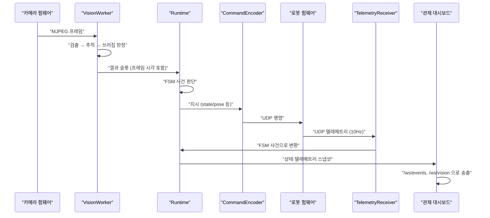

# 코드 읽는 순서

이 저장소를 처음 본다면, 15분 안에 전체 구조를 파악할 수 있도록 아래 순서를 따라 읽는다. [문서 색인](README.md)이 문서 전체를 다루는 지도라면, 이 문서는 코드를 실제로 열어 볼 때 어떤 파일부터 봐야 하는지를 알려주는 안내다.

## 디렉터리 역할

파일 수는 2026-09-29 기준 실제 개수다. Python 디렉터리는 `.py` 파일을 세고 `__init__.py`는 뺐다. `tools/` 안의 시험 파일(`test_*.py`)도 뺐다. 펌웨어 디렉터리는 소스 파일(`.ino`·`.cpp`·`.h`)을 세고, 호스트 시험(`test/`)·진단 스케치(`diagnostics/`)·설정 템플릿(`*.example.h`)은 뺐다.

| 디렉터리 | 역할 | 파일 수 |
|---|---|---|
| `host/behavior/` | FSM·시퀀스·미션, 그리고 런타임에서 떼어 낸 판정기(인증·추종·쓰러짐·구역·PPE) | 18 |
| `host/vision/` | 카메라 스트림 수신·추론 워커·VLM 판독 | 12 |
| `host/common/` | 통신 규약 인코더/디코더 (Host ↔ 로봇) | 8 |
| `host/telemetry/` | 로봇 텔레메트리를 FSM 사건으로 변환 | 1 |
| `host/dashboard/` | 관제 서버(FastAPI)와 웹 대시보드 | 3 |
| `host/slam/` | LiDAR 스캔 정합과 지도 생성 | 10 |
| `host/report/` | 실기 리포트 생성 | 1 |
| `host/cloud/` | 외부 연동(원격 갱신 등) | 1 |
| `host/runtime.py` | 위 모듈을 묶어 운용 루프를 도는 진입점 | 1 |
| `host/fleet.py` | 여러 대를 한 프로세스·한 소켓으로 함께 운용 | 1 |
| `firmware/mechdog_motion/` | 로봇 본체 펌웨어(모션·Tier 1 반사) | 21 |
| `firmware/xiao_vision/` | 카메라 모듈 펌웨어(MJPEG 스트림) | 1 |
| `firmware/lidar_relay/` | LiDAR 중계 보드 펌웨어 | 5 |
| `tools/` | 운영·측정·개발 보조 스크립트 | 59 |
| `tests/` | 단위·통합 테스트 | 89 |

## 읽는 순서

1. **`docs/ARCHITECTURE.md`** — 전체 구조와 용어(Tier 1/2/3, FSM, ADR)를 먼저 잡는다. 코드를 읽기 전에 이 문서 없이는 왜 이렇게 나눠져 있는지 이해하기 어렵다.
2. **`host/common/protocol.py`** — Host와 로봇이 주고받는 메시지의 정본. `CommandEncoder`/`CommandDecoder`, `TelemetryEncoder`/`TelemetryDecoder`가 이 파일에 있다. 여기를 보면 "Host가 로봇에 무엇을 보낼 수 있는지"와 "로봇이 무엇을 보고하는지"가 그대로 드러난다.
3. **`host/behavior/fsm.py`** — 상태 전이표. 상태 이름과 전이 조건을 코드가 아니라 데이터(표)로 표현한 것이 이 프로젝트의 핵심 설계다. 모듈 docstring에 명령 타임아웃 등 FSM과 무관한 안전장치가 무엇인지도 정리돼 있다.
4. **`host/vision/worker.py`** — 카메라 프레임을 받아 검출·추적·PPE 판정을 만드는 추론 워커. 수신 스레드와 추론 스레드가 분리된 이유는 [features/vision-stream.md](features/vision-stream.md)에 판단 흐름도로 정리돼 있다.
5. **`host/runtime.py`** — 위 모듈들을 묶어서 10Hz로 도는 운용 루프. 모듈 docstring의 파이프라인 다이어그램(`소켓 → 수신기 → 사건 → FSM → 지시 → 송신기 → 소켓`)을 먼저 읽고 나서 `main()` → `Runtime.serve()` 순으로 따라가면 전체 흐름이 잡힌다.
6. **`host/dashboard/server.py`** — 관제 서버. FSM 상태와 텔레메트리를 `/ws/events`·`/ws/vision`으로 내보내는 부분만 보면 된다. `EventHub` 클래스가 시작점이다.
7. **`docs/features/`** — 여기까지 읽고 나면 기능별 문서(페일세이프·장애물 회피·비전 스트림·쓰러짐 판정 등)의 판단 흐름도가 코드와 바로 대응된다.

PPE(개인보호구) 판정은 `host/vision/worker.py`에 배선돼 있고, 배포 모델은 `ppe-v5`(YOLOX-S 4클래스)다. 검수 기록은 [PPE_ACCEPTANCE.md](PPE_ACCEPTANCE.md)에 있다.

## 전체 데이터 흐름

카메라 프레임 한 장이 로봇의 정지 명령으로, 그리고 다시 대시보드 화면으로 돌아오기까지의 경로다.



## 5분 안에 실행해 보기

로봇 없이 전체 파이프라인을 확인하는 순서다. 자세한 스크립트 목록은 [tools/README.md](../tools/README.md)에 있다.

```bash
# 1. 가상 로봇을 띄운다
python tools/mock/mock_mechdog.py --device mechdog-01

# 2. 가상 로봇을 상대로 호스트 런타임과 관제 대시보드(8000번 포트)를 띄운다
#    가상 로봇도 실물처럼 안전 래치가 걸린 채 켜진다 — 관제 화면의 «안전 해제 (RESET_SAFE)» 를 누른 뒤에 움직인다
python -m host.runtime --device mechdog-01 --robot-ip 127.0.0.1 --dashboard-port 8000

# 3. 별도 터미널에서 단위 테스트를 돌린다
pytest -q
```

CI(`ci.yml`)는 여기에 더해 `ruff check`/`ruff format --check`, `tools/dev/check_doc_links.py`(문서 링크 검증), 커버리지 게이트(`--cov-fail-under=80`)를 검사한다.
