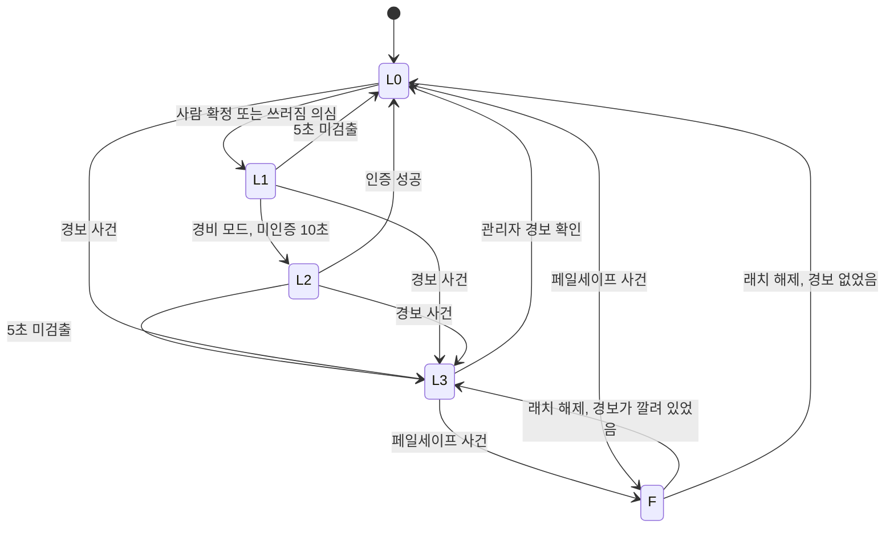
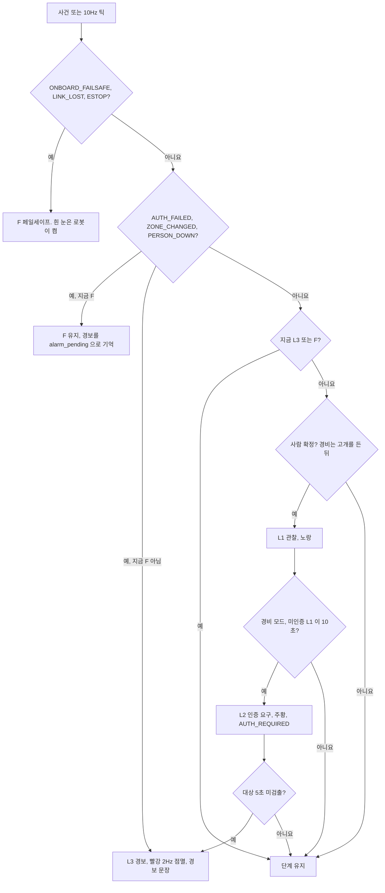
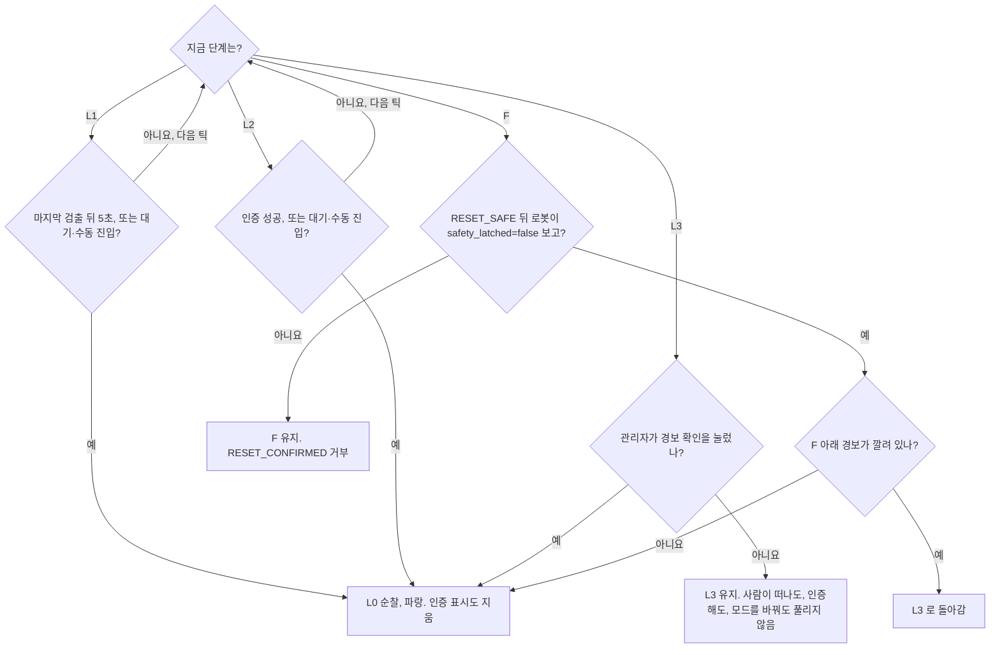

# 대응 에스컬레이션

로봇이 사람·사건에 얼마나 강하게 대응하는지를 L0~L3 와 F 다섯 단계로 정한다. FSM 상태(무엇을 하는가)와는 따로 도는 축이다.
올리는 것은 사건과 시간 조건이 하고, 내리는 것은 단계마다 정해진 조건이 한다. L3(경보)와 F(페일세이프)는 사람이 확인해야만 내려간다.
두 확인 경로를 나눠 두어, 비상정지나 모드 전환으로 경보를 지우는 길을 막는다.

## 판단 흐름

### 단계 전체

L1·L2 에서도 페일세이프 사건은 곧바로 F 로 간다. 그림을 줄이려고 L0·L3 에서만 그렸다.

### 올라가는 흐름

### 내려가는 흐름

## 판단 기준

| 조건 | 값 | 설정 키 | 근거 |
| :--- | :--- | :--- | :--- |
| L1 진입 | 사람 확정 (300ms 안 3회). 경비는 고개를 든 뒤 | `vision.detect_window_ms` · `vision.detect_hits_required` | [ADR-25](../DECISIONS.md#adr-25) · [ADR-40](../DECISIONS.md#adr-40) |
| L1 → L2 | 미인증 L1 10초, 경비 모드만 | `escalation.l1_to_l2_hold_s` | [ADR-40](../DECISIONS.md#adr-40) |
| L1 → L0 · L2 → L3 | 마지막 실제 검출 뒤 5초 | `fsm.target_lost_timeout_s` | [ADR-26](../DECISIONS.md#adr-26) |
| L2 → L0 | 인증 성공 (`AUTH_OK` 또는 보이는 전원 인증) | — | [ADR-26](../DECISIONS.md#adr-26) |
| L3 진입 사건 | `AUTH_FAILED` (경비) · `ZONE_CHANGED` · `PERSON_DOWN` (공장) | — | [ADR-26](../DECISIONS.md#adr-26) · [ADR-42](../DECISIONS.md#adr-42) |
| F 진입 사건 | `ONBOARD_FAILSAFE` · `LINK_LOST` · `ESTOP` | — | [ADR-26](../DECISIONS.md#adr-26) |
| L3 해제 | 관리자 경보 확인만 (코드에 고정, 설정으로 바꿀 수 없음) | — | [ADR-26](../DECISIONS.md#adr-26) |
| F 해제 | 로봇이 래치 해제를 보고한 `RESET_CONFIRMED` 만 | — | [ADR-26](../DECISIONS.md#adr-26) |
| 모드 전환 | `IDLE` · `MANUAL` 에서만 받고 단계는 건드리지 않음 | `mission.mode` | [ADR-33](../DECISIONS.md#adr-33) |
| 눈 LED | L0 파랑 · L1 노랑 · L2 주황 · L3 빨강 · F 흰색 | `escalation.led` | [눈 LED 실기](../../TEST_MECHDOG/results/20260919_4.7.3-eye-led-host/summary.md) |
| L3 점멸 | 2Hz | `escalation.led.l3_blink_hz` | [눈 LED 실기](../../TEST_MECHDOG/results/20260919_4.7.3-eye-led-host/summary.md) |
| L3 문장 | 원인별 문장이 있으면 그것, 없으면 공통 문장 | `escalation.sound.l3_warning` · `escalation.sound.person_down_warning` | [ADR-38](../DECISIONS.md#adr-38) |

## 실패·예외 시 동작

- 단계는 순서가 있다(F > L3 > L2 > L1 > L0). 올리기는 지금보다 높을 때만 한다. 사건 순서가 뒤바뀌어도 단계가 내려가지 않는다.
- F 중에 경보 사건이 오면 F 를 유지하고 경보를 기억한다. 래치를 풀면 L0 이 아니라 L3 로 돌아간다. 비상정지를 눌렀다 풀어 경보를 지우는 길을 막는다.
- 관리자 경보 확인은 F 를 풀지 않는다. 경보를 끄려는 조작이 물리 안전 래치까지 풀면 넘어진 로봇이 다시 움직인다.
- 로봇의 안전 래치가 아직 걸려 있으면 `RESET_CONFIRMED` 가 거부되고 F 도 그대로다. 호스트만 풀리는 어긋남을 막는다.
- 경보 확인·래치 해제 요청은 다른 스레드(대시보드·콘솔)에서 예약만 하고 다음 틱 시작에서 처리한다. 비상정지만 틱을 기다리지 않는다.
- L3 경보 확인이 구역 변화 경보였으면 `ZONE_ALARM_CONFIRMED` 로, 쓰러짐 경보였으면 `FALL_RESOLVED` 로 순찰에 돌아간다.
- 모드 전환은 `IDLE`·`MANUAL` 에서만 받는다. 그 상태에서는 L1·L2 가 이미 L0 으로 내려가 있고, L3·F 는 전환 뒤에도 남는다. 모드를 바꾸는 것이 확인 없는 해제 경로가 되지 않는다.
- 대기·수동에서는 사람을 확정해도 단계를 올리지 않고 인증도 판정하지 않는다.
- 공장 모드는 사람만으로 L1 을 올리지 않고 L2 를 만들지 않는다. 공장 모드의 L1 은 쓰러짐 의심뿐이다([쓰러짐 확정](factory-fall.md)).
- 공장 모드의 PPE 판정은 개발 중이라 이 문서에서 다루지 않는다. 그 경고는 래치하지 않는 L3 표현(`Escalation.warn`)을 쓰며, 경고 중에 경보 사건이 오면 래치된 L3 로 바뀐다.

## 코드와 검증

| 분기 | 코드 위치 | 확인하는 테스트 |
| :--- | :--- | :--- |
| 사건 → L3 · F 표 | `host/behavior/escalation.py` 의 `RAISED_BY` · `Escalation.note_event` | `test_event_table_raises_only_to_alarm_or_failsafe` · `test_every_alarm_cause_reaches_l3` · `test_every_failsafe_cause_reaches_f` |
| 올리기만 하고 내리지 않음, F 가 최상위 | `host/behavior/escalation.py` 의 `Escalation.raise_to` | `test_failsafe_outranks_alarm` · `test_failsafe_wins_over_alarm` |
| 사람 확정 → L1, 래치 중 무시 | `host/behavior/escalation.py` 의 `Escalation.note_person` | `test_confirmed_person_enters_observe` · `test_unconfirmed_person_does_not_raise` · `test_alarm_does_not_release_when_person_leaves` |
| 경비는 고개를 든 뒤 L1 | `host/runtime.py` 의 `Runtime._poll_vision` | `test_confirmed_person_raises_observe_level` |
| L1 5초 → L0 | `host/behavior/escalation.py` 의 `Escalation.tick` | `test_observe_releases_after_target_lost` · `test_continued_sighting_keeps_observe_alive` |
| L1 10초 미인증 → L2 | `host/behavior/escalation.py` 의 `Escalation.tick` | `test_unauthenticated_hold_escalates_to_auth_request` · `test_authenticated_person_never_escalates` |
| L2 인증 → L0, L1 은 인증으로 내리지 않음 | `host/behavior/escalation.py` 의 `Escalation.note_authenticated` | `test_authentication_releases_auth_request` · `test_authenticated_person_does_not_make_the_level_flap` |
| L2 5초 미검출 → L3 | `host/behavior/escalation.py` 의 `Escalation.tick` | `test_walking_away_unauthenticated_becomes_alarm` |
| 상태 타이머의 `AUTH_FAILED` 도 단계에 반영 | `host/runtime.py` 의 `Runtime.tick` | `test_auth_timeout_raises_alarm_without_passing_through_apply` |
| 대기·수동에서 L1·L2 내림, L3 유지 | `host/behavior/escalation.py` 의 `Escalation.stand_down` | `test_manual_takeover_stands_down_but_keeps_an_alarm` · `test_person_near_an_idle_robot_raises_no_level` |
| L3 는 관리자 확인으로만 해제 | `host/behavior/escalation.py` 의 `Escalation.confirm_alarm` · `host/runtime.py` 의 `Runtime.confirm_alarm` | `test_manual_confirmation_releases_alarm` · `test_confirm_alarm_is_the_way_back` · `test_alarm_does_not_release_by_authentication` |
| 대시보드 경보 확인 명령 | `host/dashboard/commands.py` 의 `CommandService.alarm_confirm` · `host/runtime.py` 의 `Runtime._drain_confirmations` | `test_alarm_confirm_releases_the_alarm_on_the_next_tick` · `test_alarm_endpoint_round_trips` |
| 경보 확인은 F 를 풀지 않음 | `host/behavior/escalation.py` 의 `Escalation.confirm_alarm` | `test_confirming_alarm_does_not_release_failsafe` · `test_alarm_confirm_does_not_clear_the_failsafe` |
| F 해제는 로봇 래치 해제 뒤만 | `host/behavior/escalation.py` 의 `Escalation.note_event` · `host/runtime.py` 의 `Runtime._settle_reset` | `test_robot_unlatch_releases_failsafe` · `test_rejected_reset_does_not_release_failsafe` · `test_failsafe_does_not_release_automatically` |
| F 해제 뒤 깔린 경보로 복귀 | `host/behavior/escalation.py` 의 `Escalation.confirm_failsafe` | `test_estop_cannot_be_used_to_clear_an_alarm` · `test_alarm_confirmed_during_failsafe_returns_after_the_reset` · `test_failsafe_without_alarm_returns_to_patrol` |
| 모드 전환은 래치를 풀지 않음 | `host/behavior/mission.py` 의 `Mission.switch` | `test_mode_switch_does_not_clear_a_latched_level` · `test_mode_switch_is_refused_while_patrolling` |
| 공장 모드는 L2 없음 | `host/behavior/escalation.py` 의 `Escalation.tick` | `test_modes_without_auth_never_enter_auth_escalation` · `test_factory_person_keeps_the_eye_blue` |
| 눈 LED · 경고 문장 | `host/behavior/escalation.py` 의 `Escalation.presentation` · `host/runtime.py` 의 `Runtime._emit_eye_led` | `test_led_covers_every_level` · `test_eye_led_follows_the_escalation_level` · `test_a_fall_reads_its_own_sentence` |

실측 기록

- [눈 LED 단계 표시 실기](../../TEST_MECHDOG/results/20260919_4.7.3-eye-led-host/summary.md)
- [헤드리스 경보 해제와 판정 대기 연장 실기](../../TEST_MECHDOG/results/20260922_alarm-web-release/summary.md)
- [경비 대응 실기: L1 에서 L2 까지](../../TEST_MECHDOG/results/20260923_patrol-engage/summary.md)
