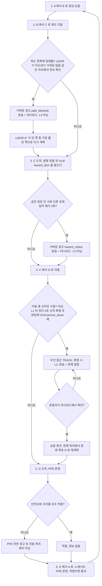

# 공장 모드 시연 시나리오 (4구역 한 바퀴)

공장 모드 시연의 한 바퀴를 A→B→C→D 고정 순서로 정한다. 정상 순찰, 이동 중 막힘 우회, 위험구역의 화기 위험물, 쓰러진 사람, 보호구 위반과 적합을 한 바퀴에 모두 보여 준다.
결정과 대안은 [ADR-43](../DECISIONS.md#adr-43), 정본 표는 [PRD FR-11 시연 시나리오](../internal/PRD_Physical_AI_Guard_Robot.md) 소절이다.
이 페이지는 그 흐름이 어느 설정과 어느 코드로 이어지는지만 한 장에 모은다.

## 판단 흐름

## 2026-10-07 시연 촬영 (현장 기체 `mechdog-02`)

- 현장 기체 설정은 위험구역을 **A 작업실**로 둔다(`config/devices/mechdog-02.yaml` `zones.hazard_ids`). 위 표의 C 는 공장 모드 기본값이다.
- **화기 위험물 장면은 라이터만 쓴다 (사용자 결정 · 2026-10-07).** 로봇 시점 합성 학습 후보(Release `hazard-synth-v2`)가 미학습 실물 사진에서 라이터는 0.87·0.88 로 잡았지만 보조배터리는 0/5 였다. 안내 음성은 물건 이름 없이 «화기 위험물» 하나(TF 0193)다.
- 근거: [10-06 현장 실측](../measurements/2026-10-06-field-patrol.md), [WBS 4.8.6](../internal/WBS.md). 보조배터리 검출은 실물 사진을 더 모아 재학습해야 한다(미착수).

## 판단 기준

| 조건 | 값 | 설정 키 | 근거 |
| :--- | :--- | :--- | :--- |
| 구역 | A·B·C·D, 복도로 연결 | `zones.ids` | [ADR-43](../DECISIONS.md#adr-43) |
| 방문 순서 | 매 바퀴 A→B→C→D 고정 | `zones.random_after_first_cycle: false` | [ADR-43](../DECISIONS.md#adr-43) |
| 화기 위험구역 | C | `zones.hazard_ids: [C]` | [ADR-43](../DECISIONS.md#adr-43) |
| 화기 위험물 확정 | 같은 방문 안 서로 다른 프레임의 «예» 2회 | `change_detect.vlm_hazard_items` (기본 켬) | [ADR-43](../DECISIONS.md#adr-43) · [ADR-41](../DECISIONS.md#adr-41) |
| 화기 위험물 확정 (검출기 · 2026-10-02 개정) | 금지 대상이 1500ms 안에 3번 이상 검출 (PPE 위반과 같은 규칙). 위험구역에서 방향을 맞춘 뒤에만 켠다 | `vision.hazard` (`enabled` · `alarm_classes` · `confirm_window_ms` · `hits_required`) | [ADR-43](../DECISIONS.md#adr-43) 대안 ⓐ 개정 |
| 이동 중 막힘 | 가벼운 경고 + LiDAR 우회, L3 아님 | 없음 | [ADR-43](../DECISIONS.md#adr-43) |
| 막힘 원인 판독 (VLM `blocked_by_fallen`) | LiDAR 가 막힘을 확정한 프레임에 한 번 묻고 답을 `path_blocked` 판정 근거 `fallen` 에 싣는다. 물었으면 기록은 답 또는 1500ms 상한에 닿을 때까지 미루고, 물을 수 없으면 바로 기록한다. 방송 문장은 켠 뒤 «예» 일 때만 «무너진 물건» 을 말함 (꺼짐 · 벤치 통과 전) | `vision.vlm.path_cause_wait_ms` · `change_detect.vlm_path_cause` | [ADR-45](../DECISIONS.md#adr-45) |
| 구역 방문 VLM `blocked_path` 가벼운 경고 `path_blocked` (L3 아님 · 2026-10-01 개정) | 꺼짐 (벤치 통과 전) | `change_detect.vlm_hazards` | [ADR-41](../DECISIONS.md#adr-41) · [VLM 카메라 벤치](../../field_tests/results/20260928_4.8.0-vlm-bench/summary.md) |
| 쓰러짐 확정 (2026-10-07 개정) | YOLOX 누움 규칙이 정지 3초를 채운 프레임의 같은 JPEG 에 VLM `person_down` «예». 불일치 · 시간 초과는 «확인 필요»(`fall_review_required`), L3 아님 | `vision.fallen.confirm_ms` · `vision.vlm.budget_ms` | [ADR-42](../DECISIONS.md#adr-42) · [ADR-47](../DECISIONS.md#adr-47) |
| PPE | 모든 구역에서 판정, 위반은 경고 뒤 자동 복귀 | `escalation.ppe_warning_hold_ms` | [ADR-42](../DECISIONS.md#adr-42) |
| 런타임 LiDAR 순찰 | 선택. 켜는 인자 | `python -m host.runtime ... --lidar-device <id>` | [ADR-43](../DECISIONS.md#adr-43) |

## 실패·예외 시 동작

- `--lidar-device` 를 주지 않으면 런타임은 전과 같이 움직인다. 위 흐름의 2단계 우회는 일어나지 않고, 막히면 초음파 온보드 회피(후진 + 좌선회)만 있다.
- VLM 은 방향을 정하지 않는다. 막힘 판정은 LiDAR 몫이고, VLM 이 없거나 늦어도 우회는 그대로 된다. VLM 은 막힘의 원인만 덧붙이며, 답이 없으면 `fallen: null` 로 기록하고 문장은 «장애물» 그대로다.
- 초음파 온보드 회피는 근거리 예비 수단으로 남는다. LiDAR 전방 부채꼴 ESTOP 은 런타임 송신 락을 거쳐 즉시 나간다.
- 가벼운 경고(`path_blocked` · `hazard_notice`)는 L3 가 아니다. 눈 LED 는 그대로이고 순찰이 이어진다.
- 쓰러짐 확정 뒤 순찰 복귀는 운용자 확인으로만 일어난다. 복귀하면 원래 목표로 경로를 다시 짠다.
- ROS2 컨테이너로의 스캔 전달과 ODOM 은 아직 런타임에 없다.

## 코드와 검증

| 단계 | 사건·단계 | 설정 | 코드 위치 |
| :--- | :--- | :--- | :--- |
| 1 순찰 | L0 | `zones.*` · `--lidar-device` | `host/runtime.py` 의 순찰 틱 · `host/behavior/patrol.py` 의 `PatrolController` |
| 2 막힘 우회 | `path_blocked` (출처 `lidar`, 판정 `x`·`y`·`target` 과 원인 판독의 `fallen`·`vlm_reason`·`raw`·`latency_ms`·`wait_ms`·`vlm_path_cause`. 값은 [VLM 단일 장면 판독](vlm-reading.md)) · 가벼운 경고 | `lidar.new_obstacle_*` | `host/behavior/patrol.py` 의 `PatrolController._check_new_obstacle` · `_replan` |
| 3 위험물 | `hazard_notice` · 가벼운 경고 | `zones.hazard_ids` · `change_detect.vlm_hazard_items` · `vision.hazard` | `host/behavior/zone_inspector.py` 의 `ZoneInspector` · `host/vision/vlm_reader.py` 의 질문 `hazard_item` · `host/vision/hazard_detector.py` 의 `HazardDetector` |
| 4 쓰러짐 | `FALL_SUSPECTED` → `PERSON_DOWN` · L1 → L3 | `fsm.fall_*` | `host/behavior/fall_monitor.py` ([쓰러짐 확정](factory-fall.md)) |
| 5 PPE | PPE 위반 경고 · 자동 복귀 | `escalation.ppe_warning_hold_ms` | `host/runtime.py` ([ADR-42](../DECISIONS.md#adr-42)) |
| 6 적합 통과 | 경보 없음 | — | `host/runtime.py` |
| 사건 문장 | 방송·대시보드 자막 | `escalation.sound.*` | `host/report/situation.py` |

시험 이름은 이 페이지에 적지 않는다. 코드가 병합되면 단계별로 시험을 확인해 이 표에 더한다. 전체 한 바퀴의 실기는 아직 하지 않았다(WBS `5.4.6`, 시연 기체 `mechdog-02`).

실측 기록

- 전체 바퀴 실기 기록은 아직 없다.
- [VLM 판독 카메라 벤치](../../field_tests/results/20260928_4.8.0-vlm-bench/summary.md) 는 막힘 적중 1/3 · 오경보 3/6 이라 VLM 이 길을 정하지 않는 근거다.
