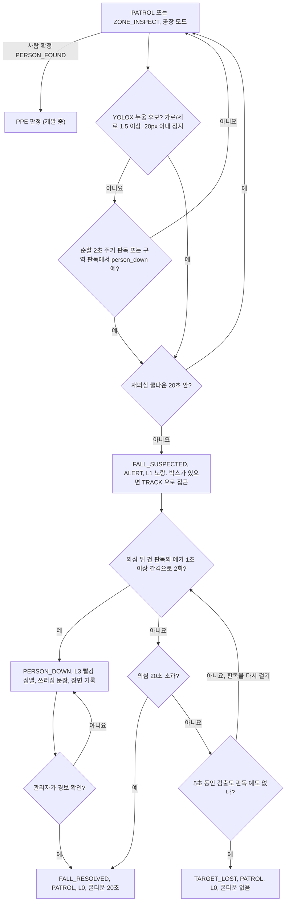

# 공장 모드 쓰러짐 확정

공장 모드에서 쓰러진 작업자를 찾아 경보(L3)를 올린다. 웅크리거나 물건을 줍는 자세 하나로 경보가 뜨지 않게 의심과 확정을 두 단계로 나눈다.
YOLOX 누움 후보나 VLM 판독 «예» 한 번은 의심(L1)만 만든다. 확정은 의심에 든 뒤 건 VLM 판독의 «예» 가 서로 1초 이상 떨어진 프레임에서 2회 모일 때뿐이다.

## 판단 흐름

## 판단 기준

| 조건 | 값 | 설정 키 | 근거 |
| :--- | :--- | :--- | :--- |
| 누움 후보: 박스 가로÷세로 | 1.5 이상 | `vision.fallen.aspect_ratio` | [ADR-42](../DECISIONS.md#adr-42) · [쓰러짐 규칙 실기](../../TEST_MECHDOG/results/20260923_person-down/summary.md) |
| 누움 후보: 정지 판정 | 박스 중심 이동 20px 이하 | `vision.fallen.still_threshold_px` | [쓰러짐 규칙 실기](../../TEST_MECHDOG/results/20260923_person-down/summary.md) |
| 누움 후보를 이어 주는 박스 공백 | 1000ms 이하 | `vision.fallen.gap_ms` | [쓰러짐 규칙 실기](../../TEST_MECHDOG/results/20260923_person-down/summary.md) |
| 순찰 중 판독 주기 | 2000ms | `vision.vlm.patrol_interval_ms` | [ADR-42](../DECISIONS.md#adr-42) |
| 확정에 필요한 판독 «예» | 2회 (의심에 들게 한 «예» 는 세지 않음) | `fsm.fall_confirm_vlm_yes` | [ADR-42](../DECISIONS.md#adr-42) · [VLM 카메라 벤치](../../TEST_MECHDOG/results/20260928_4.8.0-vlm-bench/summary.md) |
| 센 «예» 끼리의 프레임 간격 | 1000ms 이상 | `fsm.fall_confirm_gap_ms` | [ADR-42](../DECISIONS.md#adr-42) |
| 의심 제한 시간 | 20000ms | `fsm.fall_suspect_timeout_ms` | [ADR-42](../DECISIONS.md#adr-42) |
| 재의심 쿨다운 | 20000ms | `fsm.fall_resuspect_cooldown_ms` | [ADR-42](../DECISIONS.md#adr-42) |
| 의심 중 대상 상실 | 5초 | `fsm.target_lost_timeout_s` | [ADR-42](../DECISIONS.md#adr-42) |
| 확정 시 단계 | L3, 관리자 확인으로만 해제 | — | [ADR-26](../DECISIONS.md#adr-26) · [ADR-42](../DECISIONS.md#adr-42) |
| 확정 문장 | «작업자가 쓰러졌습니다. 관리자에게 통보되었습니다.» | `escalation.sound.person_down_warning` | [ADR-38](../DECISIONS.md#adr-38) |
| VLM 판독 | `person_down` 한 항목만 물음 | — | [ADR-35](../DECISIONS.md#adr-35) · [ADR-42](../DECISIONS.md#adr-42) |

## 실패·예외 시 동작

- YOLOX 누움 후보만으로는 확정하지 않는다. 워커가 3초 정지(`vision.fallen.confirm_ms`)를 채워도 로그만 남긴다.
- 판독 사이에 «아니오» 가 끼어도 센 «예» 를 지우지 않는다.
- 의심 중에 건 판독이 의심이 끝난 뒤 도착하면 버린다. 의심 전에 건 판독은 확정에 세지 않는다.
- 질문이 실패했거나 답을 «예»·«아니오» 로 읽지 못하면 값이 없으므로 «예» 로 세지 않는다. 모델이 적재되지 않았으면 판독을 걸지 않는다. 판독 워커가 바쁘거나 구역 판독이 진행 중이면 새 판독을 걸지 않고 다음 프레임에 다시 본다.
- 박스 없이 판독만으로 든 의심에서는 제자리에 선다. «예» 가 올 때마다 5초 상실 기준 시각을 새로 잡는다.
- 20초 제한 시간이나 경보 확인으로 순찰에 돌아가면 20초 동안 다시 의심하지 않는다. 누운 가방 같은 헛검출 앞에서 노랑·파랑을 되풀이하지 않게 하기 위해서다. 5초 상실로 끝난 의심에는 쿨다운을 걸지 않는다.
- 경보 확인·5초 상실·수동 전환·비상정지로 `ALERT`·`TRACK` 을 떠나면 의심도 끝난다.
- 쓰러짐 의심 중에는 PPE 판정을 보류한다. PPE 경고가 떠 있는 중에 쓰러짐이 확정되면 래치된 L3 로 바뀌고 쓰러짐 문장이 나간다.
- 카메라 쪽으로 세로로 누운 사람은 박스가 가로로 넓어지지 않아 YOLOX 후보가 되지 않는다. 그때는 VLM 판독만이 의심 경로다.
- 경비 모드에서는 쓰러짐을 기록만 하고 단계를 올리지 않는다.

## 코드와 검증

| 분기 | 코드 위치 | 확인하는 테스트 |
| :--- | :--- | :--- |
| 누움 후보 판정 (종횡비·정지·공백) | `host/vision/person.py` 의 `FallenGate.observe` | `test_the_measured_fallen_box_is_confirmed` · `test_a_standing_person_is_never_confirmed` · `test_a_sitting_person_is_never_confirmed` · `test_movement_resets_the_hold` · `test_a_short_detection_gap_keeps_the_hold` |
| 누움 후보 → 의심, 접근 | `host/runtime.py` 의 `Runtime._observe_fallen` · `Runtime._track` · `host/behavior/fall_monitor.py` 의 `FallMonitor.suspect` | `test_a_lying_candidate_suspects_a_fall_and_approaches` |
| 순찰 판독 «예» → 의심, 진입 «예» 는 세지 않음 | `host/behavior/fall_monitor.py` 의 `FallMonitor.ask` · `FallMonitor.take_reading` | `test_a_patrol_reading_asks_only_person_down_every_interval` · `test_a_reading_alone_suspects_and_its_entry_answer_does_not_count` |
| 구역 판독 «예» → 의심 | `host/runtime.py` 의 `Runtime._take_zone_reading` | `test_a_person_down_reading_at_a_zone_suspects_a_fall_not_an_alarm` · `test_a_person_down_reading_that_lands_after_leaving_still_suspects` |
| «예» 2회, 1초 간격 → `PERSON_DOWN` | `host/behavior/fall_monitor.py` 의 `FallMonitor.take_reading` · `FallMonitor._confirm` | `test_a_fall_is_confirmed_by_readings_a_gap_apart` · `test_a_no_between_readings_does_not_reset_the_count` |
| YOLOX 단독 확정 없음 | `host/runtime.py` 의 `Runtime._observe_fallen` | `test_lying_alone_never_raises_the_alarm` |
| `PERSON_DOWN` → L3, 상태는 그대로 | `host/behavior/escalation.py` 의 `RAISED_BY` · `host/behavior/fall_monitor.py` 의 `FallMonitor._confirm` | `test_factory_fall_raises_l3_without_moving_the_state` · `test_a_confirmed_fall_is_recorded_with_its_reason` |
| 의심 동안 L1 유지 | `host/behavior/escalation.py` 의 `Escalation.note_fall_suspect` · `Escalation.tick` | `test_a_fall_suspect_holds_observe_until_released` |
| 20초 제한 시간 → 순찰 | `host/behavior/fall_monitor.py` 의 `FallMonitor.watch` · `FallMonitor.resolve` | `test_an_unconfirmed_suspect_times_out_back_to_patrol` |
| 재의심 쿨다운 | `host/behavior/fall_monitor.py` 의 `FallMonitor.suspect` | `test_a_timed_out_suspect_is_not_suspected_again_during_the_cooldown` · `test_a_confirmed_fall_is_not_raised_again_right_after_the_confirm` |
| 5초 상실로 의심 종료 (쿨다운 없음) | `host/behavior/fall_monitor.py` 의 `FallMonitor.watch` · `FallMonitor._end` | `tests/test_fall_monitor.py::test_losing_the_target_ends_the_suspicion_without_a_cooldown` |
| 경보 확인 → 순찰 | `host/runtime.py` 의 `Runtime.confirm_alarm` | `test_confirming_a_fall_alarm_returns_to_patrol` |
| PPE 경고 중 확정 | `host/behavior/escalation.py` 의 `Escalation.raise_to` | `test_a_fall_confirmed_during_a_ppe_warning_announces_its_own_sentence` · `test_an_alarm_during_the_ppe_warning_latches` |
| 의심 중 PPE 보류 | `host/runtime.py` 의 `Runtime._judge_ppe` | `test_factory_holds_ppe_while_a_fall_is_a_candidate` |
| 경비 모드는 기록만 | `host/behavior/mission.py` 의 `FEATURES` · `host/runtime.py` 의 `Runtime._observe_fallen` | `test_guard_fall_is_recorded_but_does_not_raise_the_alarm` · `test_guard_mode_does_not_announce_a_fall` |
| 판독 워커 비동기 제출·수거 | `host/vision/vlm_worker.py` 의 `VlmWorker.submit` · `VlmWorker.take` | `test_second_submit_while_busy_is_refused` · `test_submit_is_refused_when_the_reader_is_not_loaded` · `test_submit_passes_the_question_keys_to_the_reader` |
| 판독 한 번 (예산·실패·파싱) | `host/vision/vlm_reader.py` 의 `VlmReader.read` | `test_unknown_is_not_false` · `test_unparsed_answer_keeps_the_raw_text` · `test_partial_reading_is_kept_on_failure` · `test_reading_can_ask_only_some_questions` |

실측 기록

- [쓰러짐 규칙 실기 (누움 후보 판정)](../../TEST_MECHDOG/results/20260923_person-down/summary.md)
- [VLM 판독 카메라 벤치 (person_down 적중·오경보·지연)](../../TEST_MECHDOG/results/20260928_4.8.0-vlm-bench/summary.md)
