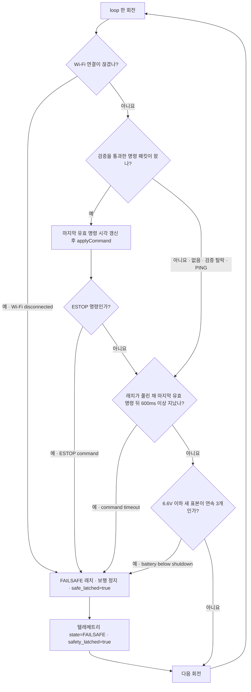
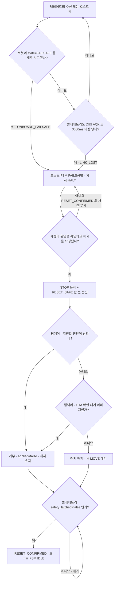
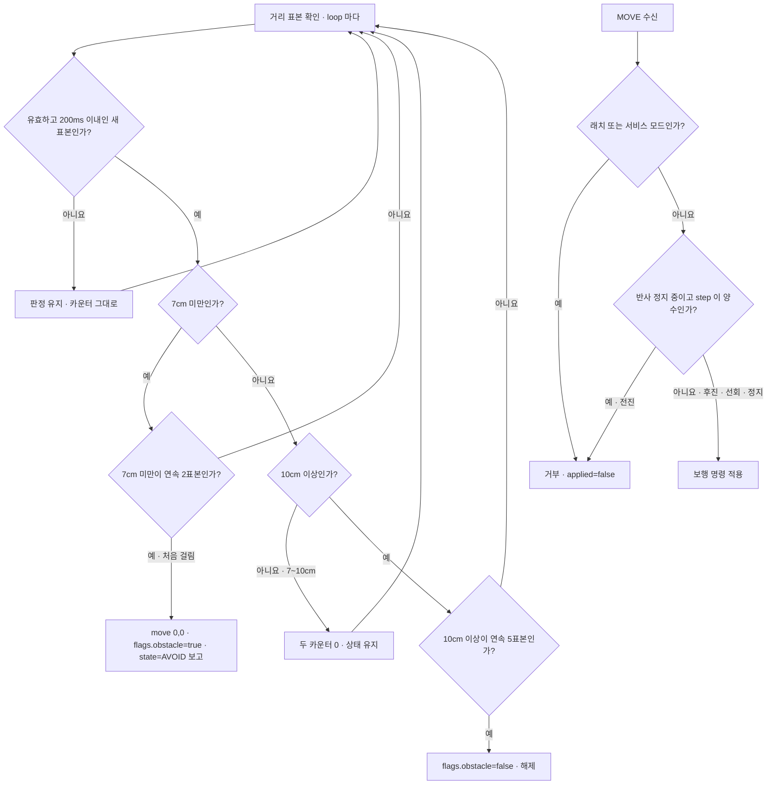

# 제어 링크와 페일세이프

호스트가 멈추거나 무선이 끊기거나 배터리가 떨어져도 로봇이 혼자 걷지 않게 한다. 판정은 로봇 펌웨어(Tier 1)가 하고, 호스트는 로봇의 보고를 따라갈 뿐이다.
한 번 걸린 페일세이프는 사람이 해제를 누르고, 로봇이 래치가 풀렸다고 보고해야 풀린다. 원인이 남아 있으면 로봇이 해제를 거부한다.

## 판단 흐름

### 1. 래치를 거는 쪽 (펌웨어 `loop()` 한 회전)

### 2. 호스트가 따라가고 해제하는 쪽

### 3. 초음파 반사 정지 (펌웨어 `SafetyMonitor`)

반사 정지는 래치가 아니다. 전진만 막고, 전방이 비면 로봇이 스스로 푼다. 회피 동작은 [순찰 중 장애물 대응](patrol-obstacle.md)에 있다.

## 판단 기준

| 조건 | 값 | 설정 키 | 근거 |
| :--- | :--- | :--- | :--- |
| 명령 타임아웃 → 래치 | 마지막 유효 명령 뒤 600ms 이상 (첫 유효 명령을 받은 뒤, 래치가 풀려 있을 때만) | `safety.cmd_timeout_ms` · 펌웨어 `kCommandTimeoutMs` | [ADR-39](../DECISIONS.md#adr-39) |
| 온보드 링크 두절 → 래치 | Wi-Fi 연결 끊김, 즉시 | 없음 (`WiFi.status()`) | — |
| 링크 정상 표시 `link_ok` | 마지막 유효 명령이 3000ms 이내 (표시만 하고 래치하지 않음) | 펌웨어 `kLinkHealthyAgeMs` (`safety.link_loss_failsafe_ms` 와 같은 값) | — |
| 호스트 링크 두절 → `LINK_LOST` | 텔레메트리와 명령 ACK 가 모두 3000ms 이상 없음 (첫 수신 전에는 보지 않음). *(2026-10-07 개정 — [ADR-47](../DECISIONS.md#adr-47))* `verdict` 와 `applied` 가 있는 명령 ACK 도 텔레메트리처럼 링크 시계를 갱신하고(`host/runtime.py` `_is_command_ack`), ACK 의 `safe_latched` 는 래치 해제 확인에도 반영된다 | `safety.link_loss_failsafe_ms` | — |
| 저전압 경고 `lowbatt` | 7.0V 이하 1표본 (동작을 막지 않음) | `safety.battery_warn_v` | [저전압 실측](../../field_tests/results/20260917_3.2.6-obstacle-stop/battery.md) |
| 저전압 셧다운 → 래치 | 6.6V 이하 새 표본 연속 3개 | `safety.battery_shutdown_v` | [저전압 실측](../../field_tests/results/20260917_3.2.6-obstacle-stop/battery.md) |
| 셧다운 재무장 · 해제 허용 | 7.0V 초과로 회복 | `safety.battery_warn_v` | [저전압 실측](../../field_tests/results/20260917_3.2.6-obstacle-stop/battery.md) |
| 반사 정지 | 7cm 미만 연속 2표본(2026-10-06 25→7) (센서 주기 40ms) | `safety.obstacle_stop_cm` | [반사 정지 실측](../../field_tests/results/20260917_3.2.6-obstacle-stop/summary.md) |
| 반사 해제 | 10cm 이상 연속 5표본(2026-10-06 30→10) | 펌웨어 `kObstacleClearCm` · `clear_samples` (설정 키 없음) | [반사 정지 실측](../../field_tests/results/20260917_3.2.6-obstacle-stop/summary.md) |
| 표본 신선도 | 측정 뒤 200ms 이내, 같은 표본은 한 번만 셈 | 펌웨어 `max_sample_age_ms` (설정 키 없음) | — |
| 반사 정지 중 허용 명령 | 후진·제자리 조향(step 0)·정지 | 없음 | [ADR-22](../DECISIONS.md#adr-22) |
| `RESET_SAFE` 거부 | Wi-Fi 끊김 · 저전압 원인 남음 · OTA 확인 대기 이미지 | 없음 | [ADR-21](../DECISIONS.md#adr-21) |
| 호스트 `FAILSAFE` 탈출 | 로봇이 `safety_latched=false` 를 보고한 뒤 `RESET_CONFIRMED` | 없음 | [ADR-21](../DECISIONS.md#adr-21) |

## 실패·예외 시 동작

- 기동 직후 펌웨어는 래치가 걸린 상태로 시작한다. 첫 유효 명령 전에는 명령 타임아웃을 세지 않는다.
- 규약 검증에서 버린 패킷과 `PING` 은 마지막 유효 명령 시각을 갱신하지 않는다. 깨진 패킷이 계속 와도 600ms 가 지나면 래치된다.
- 벤더 `ACTION` 은 약 1초 동안 `loop()` 를 멈춘다. 펌웨어는 명령 처리 뒤 시각을 한 번 더 갱신해, 그 멈춤을 호스트 침묵으로 세지 않는다. 걷는 중에는 `ACTION` 을 거부한다.
- Wi-Fi 가 끊긴 동안 펌웨어는 매 회전 래치를 유지하고 3000ms 간격으로 재접속을 시도한다. 다시 연결돼도 래치는 사람의 해제를 기다린다.
- 호스트는 링크가 끊겨도 10Hz 명령 송신을 멈추지 않는다. 송신 자체가 로봇 쪽 링크 신호이기 때문이다.
- `RESET_SAFE` 가 거부되면 로봇은 `safety_latched=true` 를 계속 보고하고, 호스트는 `FAILSAFE` 에 머문 채 기다린다. 호스트 FSM 은 로봇 래치가 참인 동안 `RESET_CONFIRMED` 를 받지 않는다.
- 서비스 모드에서는 `RESET_SAFE` 를 받아 래치를 풀어도 보행이 막혀 있다. 서비스 모드를 나가면 래치가 다시 걸린다.
- 래치 중에도 `LED`·`SOUND`·`ACTION`(엎드림 자세) 은 받는다. 눈 LED 는 래치 동안 흰색으로 덮인다.
- 반사 정지는 래치 원인이 아니다. 반사 정지가 걸려 있어도 `RESET_SAFE` 는 막히지 않는다.
- 거리 센서 값이 무효이거나 200ms 보다 오래되면 새 판정을 만들지 않는다. 이미 걸린 반사 정지는 그대로 유지된다.

## 코드와 검증

| 분기 | 코드 위치 | 확인하는 테스트 |
| :--- | :--- | :--- |
| Wi-Fi 끊김 → 래치 | `firmware/mechdog_motion/mechdog_motion.ino` 의 `loop` · `latchFailsafe` | 펌웨어 단위 시험 없음 |
| 유효 명령만 시각 갱신 | `mechdog_motion.ino` 의 `handlePacket` · `host/common/protocol.py` 의 `DecodeResult.refreshes_link` | `tests/test_protocol.py::test_broken_packet_is_discarded_without_refreshing_link` |
| `ESTOP` → 래치 | `mechdog_motion.ino` 의 `applyCommand` | `tests/test_safety.py::test_estop_beats_every_other_condition` |
| 명령 타임아웃 600ms → 래치 | `mechdog_motion.ino` 의 `loop` | 펌웨어 단위 시험 없음. `tests/test_config.py::test_command_timeout_shorter_than_link_loss` 는 설정값 관계만 본다 |
| 저전압 셧다운 · 재무장 | `firmware/mechdog_motion/src/safety_monitor.cpp` 의 `SafetyMonitor::update` · `.ino` 의 `pollTelemetry` | `firmware/mechdog_motion/test/test_safety_monitor.cpp` (저전압 구간) · `tests/test_safety.py::test_low_battery_latches_and_beats_the_host_view` |
| 반사 정지 · 해제 히스테리시스 · 신선도 | `firmware/mechdog_motion/src/safety_monitor.cpp` 의 `SafetyMonitor::update` · `fresh_sample` | `firmware/mechdog_motion/test/test_safety_monitor.cpp` (근거리 정지 구간) |
| 전진만 거부 | `firmware/mechdog_motion/src/safety_monitor.h` 의 `move_allowed` · `SafetyMonitor::allows_move` | `firmware/mechdog_motion/test/test_safety_monitor.cpp` (조합 전수) · `tests/test_safety.py::test_obstacle_blocks_forward_only` |
| `RESET_SAFE` 거부 (저전압) | `firmware/mechdog_motion/src/safety_monitor.h` 의 `reset_safe_allowed` · `.ino` 의 `applyCommand` | `tests/test_safety.py::test_reset_safe_is_refused_while_the_cause_remains` · `tests/test_safety.py::test_obstacle_does_not_block_the_reset` |
| `RESET_SAFE` 거부 (OTA 확인 대기 · Wi-Fi 끊김) | `mechdog_motion.ino` 의 `applyCommand` | 시험 없음 |
| 로봇 `FAILSAFE` 보고 → 호스트 `FAILSAFE` | `host/telemetry/receiver.py` 의 `TelemetryReceiver._events_for` · `host/behavior/fsm.py` 의 `TRANSITIONS` | `tests/test_telemetry_receiver.py::test_robot_reporting_failsafe_becomes_an_event` · `tests/test_runtime.py::test_robot_failsafe_report_drives_the_host` |
| 텔레메트리 3000ms 두절 → `LINK_LOST` | `host/behavior/fsm.py` 의 `Behavior._watch_links` | `tests/test_fsm.py::test_robot_link_loss_goes_to_failsafe` · `tests/test_fsm.py::test_links_are_not_watched_before_the_first_message` |
| `FAILSAFE` 는 해제 외 사건 무시 | `host/behavior/fsm.py` 의 `EXCLUSIVE` · `Fsm._target_for` | `tests/test_fsm.py::test_failsafe_accepts_nothing_but_a_confirmed_reset` |
| 래치 보고가 풀릴 때까지 해제 보류 | `host/runtime.py` 의 `Runtime.request_reset` · `Runtime._settle_reset` · `host/behavior/fsm.py` 의 `Behavior.event` | `tests/test_runtime.py::test_reset_waits_for_the_robot_latch_report` · `tests/test_fsm_guards.py::test_host_cannot_leave_failsafe_while_the_robot_reports_it` |

펌웨어 C++ 시험(`test_safety_monitor.cpp`)은 함수 단위가 아니라 `main()` 하나에 구간 주석으로 나뉘어 있다. 파이썬 시험 중 `tests/test_safety.py` 는 가상 로봇(`tools/mock/mock_mechdog.py`)을 상대로 돈다.

실측 기록

- [온보드 근거리 반사 정지](../../field_tests/results/20260917_3.2.6-obstacle-stop/summary.md)
- [저전압 감시](../../field_tests/results/20260917_3.2.6-obstacle-stop/battery.md)
- [초음파 표적 시험](../../field_tests/results/20260916_2.1.3-sonar/summary.md)
