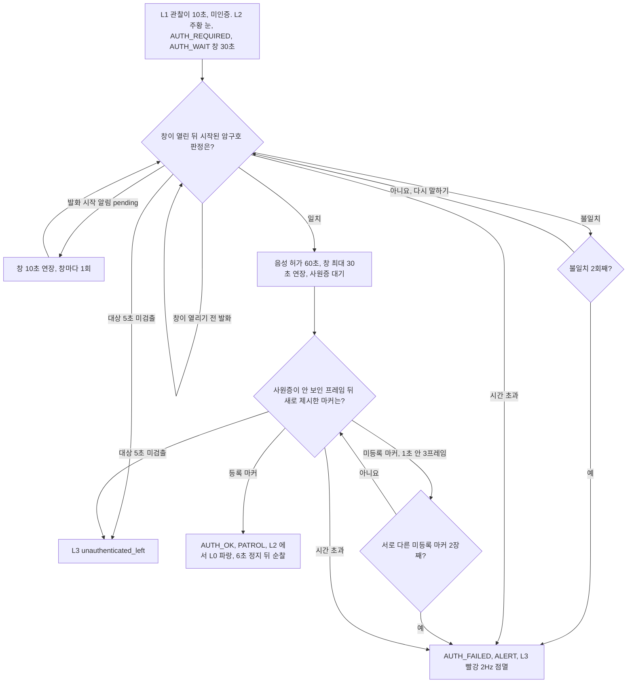

# 경비 모드 인증

경비 모드에서 로봇 앞에 머무는 사람이 출입 권한이 있는지 확인한다. 인증하지 못하거나 인증 요구를 무시하고 떠나면 경보(L3)로 올린다.
현재 설정(`auth.require_both: true`)에서는 암구호와 사원증을 둘 다 요구한다. 암구호가 먼저이고, 그 뒤에 새로 제시한 사원증 ArUco 마커가 등록된 것이어야 통과한다.
진행 단계는 눈 LED 색으로 밖에 보인다.

## 판단 흐름

L3 를 내리는 방법은 [대응 에스컬레이션](escalation.md)에 있다. 인증을 통과해도 L3 는 풀리지 않는다.

## 판단 기준

| 조건 | 값 | 설정 키 | 근거 |
| :--- | :--- | :--- | :--- |
| 인증 요구(L2)까지의 미인증 관찰 시간 | 10초 | `escalation.l1_to_l2_hold_s` | [ADR-40](../DECISIONS.md#adr-40) |
| 인증 창 | 30초 | `auth.timeout_s` | [ADR-37](../DECISIONS.md#adr-37) |
| 발화 중 판정 대기 연장 | 10초, 창마다 1회 | `auth.verdict_grace_s` | [ADR-37](../DECISIONS.md#adr-37) |
| 암구호 일치 뒤 사원증 대기 연장 | `auth.timeout_s` 만큼, 연장 합계는 `verdict_grace_s` + `timeout_s` 이하 | `auth.timeout_s` · `auth.verdict_grace_s` | [ADR-37](../DECISIONS.md#adr-37) |
| 암구호 판정 전달 | PC 음성 인식이 `ok` · `fail` · `pending` 으로 보냄 | — | [ADR-31](../DECISIONS.md#adr-31) · [ADR-38](../DECISIONS.md#adr-38) |
| 암구호·사원증 둘 다 요구 | 참 | `auth.require_both` | — |
| 시도 상한 (암구호 불일치 수, 미등록 사원증 수 각각) | 2회 | `auth.max_attempts` | [ADR-28](../DECISIONS.md#adr-28) |
| 미등록 마커를 시도로 세는 안정 검출 | 1초 안 3프레임 | `auth.unknown_marker_min_frames` | — |
| 등록 사원증 | 마커 0 → `EMP-001`, 1 → `EMP-002` | `auth.badge_marker_map` | [ADR-28](../DECISIONS.md#adr-28) |
| 인증 유효 시간 | 60초 | `auth.session_valid_s` | [ADR-28](../DECISIONS.md#adr-28) |
| 인증을 추적 ID 에 묶을지 | 거짓 (현장 단위 인증) | `auth.bind_to_track_id` | [경비 인증 실기](../../field_tests/results/20260922_guard-auth/summary.md) |
| 통과 뒤 순찰 재개 전 정지 | 6000ms | `auth.resume_delay_ms` | — |
| 인증 요구 중 대상 상실 | 5초 | `fsm.target_lost_timeout_s` | [ADR-26](../DECISIONS.md#adr-26) |
| 눈 LED | L0 파랑 · L1 노랑 · L2 주황 · L3 빨강 2Hz 점멸 | `escalation.led` | [눈 LED 실기](../../field_tests/results/20260919_4.7.3-eye-led-host/summary.md) |

## 실패·예외 시 동작

- 창이 열리기 전에 녹음이 시작된 발화는 일치든 불일치든 세지 않는다. 묻기 전에 한 대답은 인증이 아니다.
- `pending` 연장은 발화가 창 안에서 시작됐을 때만, 창마다 한 번이다. 소리를 계속 내서 경보를 막는 길을 두지 않는다.
- 암구호보다 먼저 보인 사원증은 판정하지 않는다. 암구호 일치 뒤에도 사원증이 한 번 안 보인 프레임을 거친 뒤 새로 들어야 한다.
- 같은 마커를 계속 보는 것은 한 번의 시도다. 미등록 마커가 1초 안에 3프레임 미만으로 읽히면 오검출로 보고 세지 않는다.
- 사원증 마커는 그 프레임에 사람 검출이 있을 때만 읽는다.
- `AUTH_WAIT` 에 새로 들어갈 때마다 암구호 시도 수, 음성 허가, 사원증 세션을 모두 지운다.
- 인증 요구 중 대상이 5초 보이지 않으면 창이 남아 있어도 L3 로 올린다. 인증을 무시하고 지나가는 것이 이득이 되지 않게 하기 위해서다.
- 인증은 L2 만 L0 으로 내린다. 인증된 사람이 계속 앞에 있으면 L1(노랑)에 머물고 L2 로 올라가지 않는다. 인증은 L3 를 내리지 않는다.
- 인증 유효 시간 60초가 지나면 인증 표시만 지운다. 그 자리에서 경보를 올리지 않고, L1 10초 조건이 다시 L2 로 올린다.
- `auth.bind_to_track_id` 가 거짓이라 인증은 사람이 아니라 현장에 붙는다. 60초 안에 새로 들어온 사람도 인증된 것으로 본다.
- 공장 모드와 대기·수동 상태에서는 인증 판정을 하지 않는다. 공장 모드는 L2 를 만들지 않는다.
- 로봇 페일세이프(F)는 인증과 무관하게 즉시 우선한다. 눈의 흰색은 로봇이 직접 켠다.

## 코드와 검증

| 분기 | 코드 위치 | 확인하는 테스트 |
| :--- | :--- | :--- |
| L1 10초 미인증 → L2 | `host/behavior/escalation.py` 의 `Escalation.tick` | `test_unauthenticated_hold_escalates_to_auth_request` · `test_standing_unauthenticated_person_reaches_auth_request` |
| L2 → `AUTH_REQUIRED` → `AUTH_WAIT` | `host/behavior/auth_judge.py` 의 `AuthJudge.request` | `test_auth_request_is_issued_when_the_level_reaches_l2` |
| 창 30초 초과 → `AUTH_FAILED` → L3 | `host/behavior/fsm.py` 의 `Behavior._watch_timers` · `host/runtime.py` 의 `Runtime.tick` | `test_auth_timeout_raises_alarm_without_passing_through_apply` · `test_auth_timeout_becomes_alarm` |
| 판정 전달 (`ok` · `fail` · `pending`) | `host/dashboard/commands.py` 의 `CommandService.auth` | `test_auth_endpoint_accepts_pending` · `test_auth_rejects_an_unknown_result` |
| 창 이전 발화 버림 | `host/behavior/voice_auth.py` 의 `VoiceAuthWindow.note_verdict` | `test_voice_auth_before_the_window_opened_is_not_counted` · `test_voice_auth_match_before_the_window_does_not_grant` |
| `pending` 10초 연장, 창마다 1회 | `host/behavior/voice_auth.py` 의 `VoiceAuthWindow.note_listening` · `host/behavior/fsm.py` 의 `Behavior.defer_timer` | `test_voice_listening_holds_the_window_open` · `test_voice_listening_buys_grace_only_once_per_window` · `test_voice_listening_before_the_window_buys_nothing` |
| 암구호 불일치 2회 → `AUTH_FAILED` | `host/behavior/voice_auth.py` 의 `VoiceAuthWindow.note_verdict` | `test_voice_auth_first_mismatch_keeps_waiting` · `test_voice_auth_exhausts_at_max_attempts` · `test_voice_auth_retry_can_still_pass` |
| 창마다 시도 수 초기화 | `host/runtime.py` 의 `Runtime._apply` · `host/behavior/voice_auth.py` 의 `VoiceAuthWindow.open` | `test_voice_auth_attempts_reset_on_each_auth_wait` |
| 암구호 뒤 새로 든 사원증만 통과 | `host/behavior/auth_judge.py` 의 `AuthJudge.judge` | `test_guard_requires_passphrase_then_new_badge` |
| 미등록 마커 안정 검출·시도 수 | `host/behavior/auth.py` 의 `Authenticator._judge` · `Authenticator._proven` | `test_a_single_frame_unknown_marker_is_not_an_attempt` · `test_an_unknown_marker_stable_for_three_frames_is_an_attempt` · `test_the_same_badge_seen_again_is_not_a_new_attempt` · `test_a_second_different_badge_exhausts_the_attempts` |
| 미등록 사원증 2장 → L3 (`require_both` 거짓 설정으로 시험) | `host/behavior/auth_judge.py` 의 `AuthJudge.judge` | `test_unknown_badges_exhaust_attempts_and_alarm` |
| 현장 단위 인증 | `host/behavior/auth.py` 의 `Authenticator.observe` · `Authenticator.all_authenticated` | `test_scene_badge_survives_track_churn` |
| 통과 → L0, 6초 정지 뒤 순찰 | `host/behavior/escalation.py` 의 `Escalation.note_authenticated` · `host/runtime.py` 의 `Runtime._patrol_sequence` · `host/behavior/auth_judge.py` 의 `AuthJudge.holds_patrol` | `test_authentication_releases_auth_request` · `test_full_walkthrough_person_to_authenticated` |
| 인증 중 대상 5초 상실 → L3 | `host/behavior/escalation.py` 의 `Escalation.tick` | `test_walking_away_unauthenticated_becomes_alarm` |
| 인증 60초 만료 | `host/behavior/auth.py` 의 `Authenticator.holder` · `host/behavior/auth_judge.py` 의 `AuthJudge.judge` | `test_voice_auth_expires_after_session_valid_s` · `test_expired_authentication_allows_escalation_again` |
| 인증은 L3 를 내리지 않음 | `host/behavior/escalation.py` 의 `Escalation.note_authenticated` | `test_alarm_does_not_release_by_authentication` |
| 공장 모드는 인증 없음 | `host/behavior/mission.py` 의 `Mission.enables` · `host/behavior/auth_judge.py` 의 `AuthJudge.judge` | `test_factory_mode_does_not_ask_for_a_badge` · `test_modes_without_auth_never_enter_auth_escalation` |
| 눈 LED 가 단계를 따름 | `host/runtime.py` 의 `Runtime._emit_eye_led` | `test_eye_led_follows_the_escalation_level` |

실측 기록

- [경비 모드 사원증 실기](../../field_tests/results/20260922_guard-auth/summary.md)
- [판정 대기 연장과 헤드리스 경보 해제 실기](../../field_tests/results/20260922_alarm-web-release/summary.md)
- [눈 LED 단계 표시 실기](../../field_tests/results/20260919_4.7.3-eye-led-host/summary.md)
