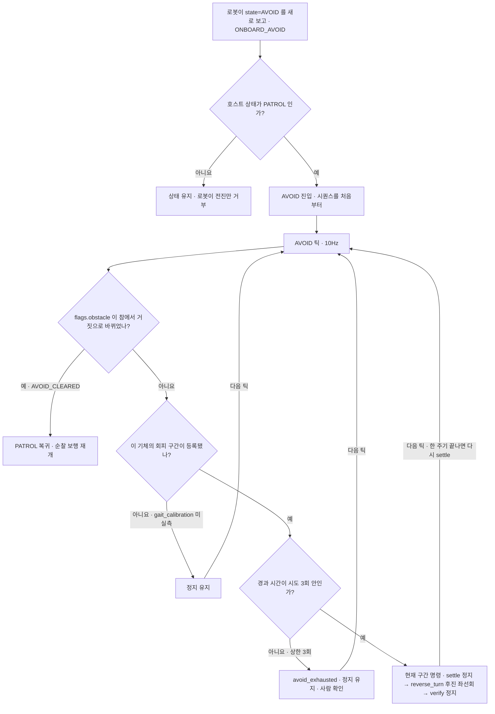
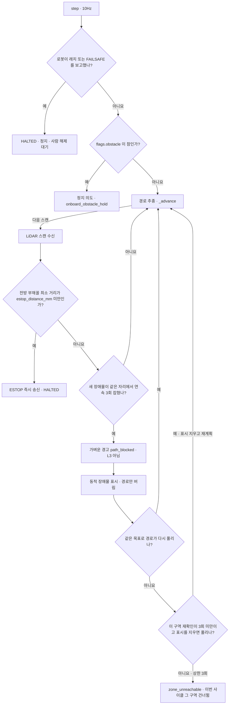

# 순찰 중 장애물 대응

로봇이 정면 장애물 앞에서 스스로 멈춘 뒤, 호스트가 물러나며 방향을 틀어 순찰을 잇게 한다. 멈춤 판정은 로봇 펌웨어가 하고([제어 링크와 페일세이프](failsafe.md) 3절), 호스트는 그 보고를 따라 회피 동작만 정한다.
빠져나오지 못하면 정해진 횟수 뒤에 멈춘 채 사람을 기다린다. 같은 장애물 앞에서 계속 흔들어 기어를 상하게 하지 않는다.

순찰 경로는 둘이다. 운용 런타임(`host/runtime.py`)은 FSM 의 `AVOID` 상태로 회피하고, LiDAR 구역 순찰기(`PatrolController`)는 초음파 정지 중에는 멈추기만 하고 LiDAR 로 경로를 다시 짠다.
순찰기는 처음에는 `tools/ops/patrol_run.py` 단독 도구로만 돌았다. 지금은 런타임이 `--lidar-device <id>` 로 직접 돌릴 수도 있다([ADR-43](../DECISIONS.md#adr-43)): PATROL 이 LiDAR A* 경로를 따르고, 측위 자세는 구역 점검에 들어가며, LiDAR 전방 ESTOP 은 런타임 송신 락을 거친다. 플래그가 없으면 위의 `AVOID` 경로만 쓴다. `tools/ops/patrol_run.py` 는 단독 시험 도구로 남는다. ROS2 컨테이너로의 스캔 전달(`lidar.scan_forward_*`)과 ODOM 송신도 같은 플래그가 켠다. 기동 관문은 `patrol_run` 과 같다: `lidar` 절 전수 검사, `localization.track == lidar`(ADR-18), 전달·ODOM 목적지 이름 해석, 지도·구역 적재 중 하나라도 실패하면 rc 2 로 기동을 거부한다.
이동 중 장애물이 길을 막으면 **가벼운 경고 `path_blocked`**(방송 + 대시보드, 출처 `lidar`, 판정 `x`·`y`·`target` 과 원인 판독의 `fallen`·`vlm_reason`·`raw`·`latency_ms`·`wait_ms`·`vlm_path_cause`. 묻지 못했으면 `fallen` 은 `null` 이고 `vlm_reason` 에 사유가 남는다. 값은 [VLM 단일 장면 판독](vlm-reading.md))를 낸 뒤 LiDAR A* 가 빈 쪽 중 가장 짧은 쪽으로 다시 계획해 이어 간다. L3 가 아니다. VLM 은 길을 정하지 않는다.
공장 모드에서는 막힘을 확정한 그 프레임에 VLM 질문 `blocked_by_fallen`(«통로를 막은 것이 무너진 물건인가»)을 걸어, 답(`fallen`)을 같은 `path_blocked` 의 판정 근거에 싣는다([ADR-45](../DECISIONS.md#adr-45)). 그래서 `path_blocked` 의 기록·방송은 답이 오거나 `vision.vlm.path_cause_wait_ms`(1500ms)를 넘길 때까지 미뤄진다. 재계획은 기다리지 않는다.

## 판단 흐름

### 1. 운용 런타임의 회피 (`AVOID` 시퀀스)

### 2. LiDAR 구역 순찰기 (`PatrolController`)

## 판단 기준

| 조건 | 값 | 설정 키 | 근거 |
| :--- | :--- | :--- | :--- |
| 반사 정지 · 해제 | 25cm 미만 연속 2표본 · 30cm 이상 연속 5표본 | `safety.obstacle_stop_cm` (해제는 펌웨어 상수) | [반사 정지 실측](../../field_tests/results/20260917_3.2.6-obstacle-stop/summary.md) |
| 해제 판단 근거 | `flags.obstacle` 의 참→거짓 변화 (플래그가 없는 펌웨어는 `AVOID`→`PATROL` 상태 변화) | 없음 | [ADR-22](../DECISIONS.md#adr-22) |
| 회피 구간 등록 조건 | `forward_mm_per_sec` · `turn_deg_per_sec` 실측값이 있음 | `gait_calibration.*` (기체 프로파일) | [ADR-29](../DECISIONS.md#adr-29) |
| settle · verify 정지 | 각 750ms | `localization.settle_delay_ms` | — |
| 후진 선회 명령 | `MOVE(-60, +20)` · 양수 각도 = 좌선회 | `gait.step_length_mm` · `gait.turn_angle_deg` | [ADR-29](../DECISIONS.md#adr-29) · [ADR-11](../DECISIONS.md#adr-11) |
| 후진 선회 시간 | 30도를 도는 시간과 200mm 물러나는 시간 중 긴 쪽 | `localization.turn_increment_deg` · `gait.reverse_distance_mm` · `gait_calibration.reverse_turn_deg_per_sec` · `reverse_turn_mm_per_sec` | [ADR-29](../DECISIONS.md#adr-29) |
| 후진 선회 미실측 기체 | 후진 200mm 뒤 전진 좌선회 30도 (옛 구간표) | `gait_calibration.reverse_mm_per_sec` (없으면 전진 속도) | [ADR-29](../DECISIONS.md#adr-29) |
| 회피 시도 상한 | 3회 | `fsm.avoid_attempts` | — |
| LiDAR 비상정지 거리 | 전방 ±20° 안 최소 거리 100mm 미만 | `lidar.estop_distance_mm` · `lidar.forward_fan_deg` | — |
| 새 장애물 확정 | 1.5m 안의 빔이 지도가 예상한 거리보다 250mm 이상 가깝고, 0.3m 안 같은 자리에서 연속 3회 | `lidar.new_obstacle_check_radius_mm` · `new_obstacle_margin_mm` · `new_obstacle_confirmations` | — |
| 구역 재확인 상한 | 구역당 사이클마다 3회 | `fsm.avoid_attempts` | — |
| 이동 중 막힘의 처리 | 가벼운 경고 `path_blocked` + LiDAR 우회 + 순찰 계속 (L3 아님) | 없음 | [ADR-43](../DECISIONS.md#adr-43) |
| 런타임이 LiDAR 순찰을 돌림 | 선택. `--lidar-device <id>` 가 있을 때만 | CLI 인자 | [ADR-43](../DECISIONS.md#adr-43) |

## 실패·예외 시 동작

- `AVOID` 는 `PATROL` 에서만 들어간다. `TRACK` 등 다른 상태에서 반사 정지가 걸리면 상태는 그대로이고, 로봇이 전진 명령만 거부한다.
- 해제 보고(`AVOID_CLEARED`)는 회피의 어느 구간에서 오든 그 틱에 `PATROL` 로 돌아간다. 전방이 비었는지는 호스트가 판정하지 않는다.
- 다시 `AVOID` 에 들어오면 시퀀스는 settle 부터 새로 시작한다. 지난 진행을 이어받지 않는다.
- 회피 구간을 만들 실측값이 없는 기체는 `AVOID` 에 시퀀스가 등록되지 않는다. 그 상태의 기본 동작은 정지이고, 기동 로그에 `sequence_unavailable` 이 남는다.
- 시도 3회를 다 쓰면 `avoid_exhausted` 를 한 번 남기고 정지를 계속 보낸다. 그 뒤에도 전방이 비면 `AVOID_CLEARED` 로 순찰에 돌아간다.
- 반사 정지 중 로봇은 후진·선회 명령을 받고 전진 명령은 거부한다(`applied=false`). 그래서 후진 선회는 반사 정지가 걸린 채로도 나간다.
- 순찰기에서 LiDAR 비상정지는 `ESTOP` 이라 로봇이 래치된다. 사람이 해제하고 로봇이 `safety_latched=false` 를 보고해야 경로 계획으로 돌아간다.
- 원인 판독이 «예» 이고 스위치 `change_detect.vlm_path_cause`(기본 꺼짐)가 켜져 있을 때만 방송 문장이 «무너진 물건이 통로를 막고 있어 돌아서 갑니다» 류로 바뀐다. 그 밖에는 «장애물이 있어 돌아서 갑니다» 그대로이고, 답은 판정 근거에만 남는다. 공장 모드가 아니거나 VLM 이 없거나 워커가 바빠 상한 안에 못 걸면 `fallen: null` 로 바로 기록한다.
- `path_blocked` 는 L3 를 올리지 않는다. 우회로가 없으면 위 «구역 재확인 상한» 대로 `zone_unreachable` 로 그 구역을 건너뛴다.
- 순찰기에서 동적 장애물 표시는 지도에 쓰지 않는다. 사이클이 끝나면 표시와 재확인 횟수를 모두 지운다.
- 순찰기에서 텔레메트리가 `safety.link_loss_failsafe_ms`(3000ms) 넘게 없으면 `HALTED`, 측위가 `localization.pose_timeout_ms` 넘게 갱신되지 않으면 `LOST` 로 멈춘다. 둘 다 명령 송신은 계속한다.

## 코드와 검증

| 분기 | 코드 위치 | 확인하는 테스트 |
| :--- | :--- | :--- |
| 로봇 `AVOID` 보고 → `ONBOARD_AVOID` | `host/telemetry/receiver.py` 의 `TelemetryReceiver._events_for` | `tests/test_telemetry_receiver.py::test_robot_reporting_avoid_becomes_an_event` |
| `PATROL` 에서만 `AVOID` 로 | `host/behavior/fsm.py` 의 `TRANSITIONS` | `tests/test_fsm.py::test_onboard_states_are_reachable_the_same_way_failsafe_is` (진입 사건이 `ONBOARD_AVOID` 하나뿐인지 본다. 출발 상태가 `PATROL` 하나뿐인지는 시험하지 않는다) |
| 플래그 참→거짓 → `AVOID_CLEARED` | `host/telemetry/receiver.py` 의 `TelemetryReceiver._obstacle_events` | `tests/test_telemetry_receiver.py::test_obstacle_flag_release_clears_avoid` · `tests/test_telemetry_receiver.py::test_missing_obstacle_flag_falls_back_to_the_state_pair` |
| 해제 후 순찰 보행 재개 | `host/behavior/fsm.py` 의 `Behavior.tick` | `tests/test_actions.py::test_leaving_avoid_returns_to_patrol_motion` |
| 재진입 시 처음부터 | `host/behavior/actions.py` 의 `AvoidSequence.restart` | `tests/test_actions.py::test_reentering_avoid_starts_from_the_beginning` |
| 실측값 없으면 정지 유지 | `host/behavior/actions.py` 의 `avoid_phases` · `register_actions` | `tests/test_actions.py::test_avoid_is_not_built_without_calibration` · `tests/test_actions.py::test_missing_calibration_leaves_avoid_stopped` |
| 구간 순서 · 후진 선회 | `host/behavior/actions.py` 의 `avoid_phases` · `AvoidSequence.phase_at` | `tests/test_actions.py::test_avoid_walks_the_phases_in_order` · `tests/test_actions.py::test_reverse_turn_replaces_the_reverse_then_turn_pair` · `tests/test_actions.py::test_reverse_turn_time_satisfies_the_slower_of_the_two_goals` |
| 후진 선회 미실측 기체 | `host/behavior/actions.py` 의 `avoid_phases` | `tests/test_actions.py::test_half_measured_reverse_turn_keeps_the_old_phases` · `tests/test_actions.py::test_reverse_falls_back_to_forward_when_unmeasured` |
| 시도 상한 3회 → 정지 | `host/behavior/actions.py` 의 `AvoidSequence.__call__` | `tests/test_actions.py::test_avoid_retries_the_configured_number_of_times` · `tests/test_actions.py::test_avoid_stops_after_exhausting_attempts` · `tests/test_actions.py::test_exhausted_is_reported` |
| 전진만 거부 | `firmware/mechdog_motion/src/safety_monitor.h` 의 `move_allowed` | `tests/test_safety.py::test_obstacle_blocks_forward_only` |
| 순찰기 래치 보고 우선 | `host/behavior/patrol.py` 의 `PatrolController._guard` | `tests/test_lidar_patrol.py::test_onboard_latch_wins_over_host_plan` |
| 순찰기 반사 정지 중 정지 | `host/behavior/patrol.py` 의 `PatrolController.step` · `SafetyView.obstacle_active` | `tests/test_lidar_patrol.py::test_reported_obstacle_holds_the_walk` · `tests/test_lidar_patrol.py::test_obstacle_release_is_read_from_the_flag` |
| 순찰기 LiDAR 비상정지 | `host/behavior/patrol.py` 의 `PatrolController.guard_scan` | `tests/test_lidar_patrol.py::test_lidar_danger_sends_estop_not_stop` · `tests/test_lidar_patrol.py::test_estop_does_not_wait_for_the_tick` |
| 새 장애물 확정 · 재계획 · 재확인 상한 | `host/behavior/patrol.py` 의 `PatrolController._check_new_obstacle` · `PatrolController._replan` | 시험 없음. `tests/test_lidar_patrol.py::test_dynamic_obstacle_does_not_change_the_map` 는 표시가 지도에 쓰이지 않는 것만 본다 |
| `path_blocked` 경고 · 런타임 LiDAR 순찰 (`--lidar-device`) | `host/behavior/patrol.py` 의 `PatrolController.steer` · `PatrolController.take_new_obstacles` · `host/runtime.py` 의 `Runtime._observe_scan` · `Runtime._record_path_blocked` · `host/telemetry/lidar_feed.py` 의 `LidarFeed.handle` | `tests/test_runtime_lidar.py::test_path_blocked_is_recorded_once_without_escalating` · `tests/test_runtime_lidar.py::test_path_blocked_without_a_frame_still_announces` · `tests/test_runtime_lidar.py::test_obstacle_outside_patrol_is_not_a_path_block` · `tests/test_runtime_lidar.py::test_reentering_patrol_replans_to_the_same_unvisited_zone` · `tests/test_runtime_lidar.py::test_close_scan_sends_estop_without_touching_the_navigator` · `tests/test_runtime_lidar.py::test_cli_lidar_device_without_zones_refuses_to_start` · `tests/test_runtime_lidar.py::test_cli_lidar_device_on_a_unit_without_the_lidar_track_refuses_to_start` · `tests/test_runtime_lidar.py::test_cli_lidar_device_with_a_bad_lidar_section_refuses_to_start` · `tests/test_lidar_patrol.py::test_steer_walks_without_announcing_state` · `tests/test_lidar_patrol.py::test_new_obstacles_are_taken_once` · `tests/test_situation.py::test_path_blocked_with_target` |
| 막힌 구역이 사이클을 끝내지 않음 | `host/behavior/patrol.py` 의 `PatrolController._replan` | `tests/test_lidar_patrol.py::test_blocked_zone_does_not_end_the_cycle_early` |

실측 기록

- [온보드 근거리 반사 정지 — 전진 거부 · 후진 허용 · 해제](../../field_tests/results/20260917_3.2.6-obstacle-stop/summary.md)
- 회피 시퀀스 전체(후진 선회 → 해제 → 순찰 재개)를 실기에서 잰 기록은 아직 없다.
