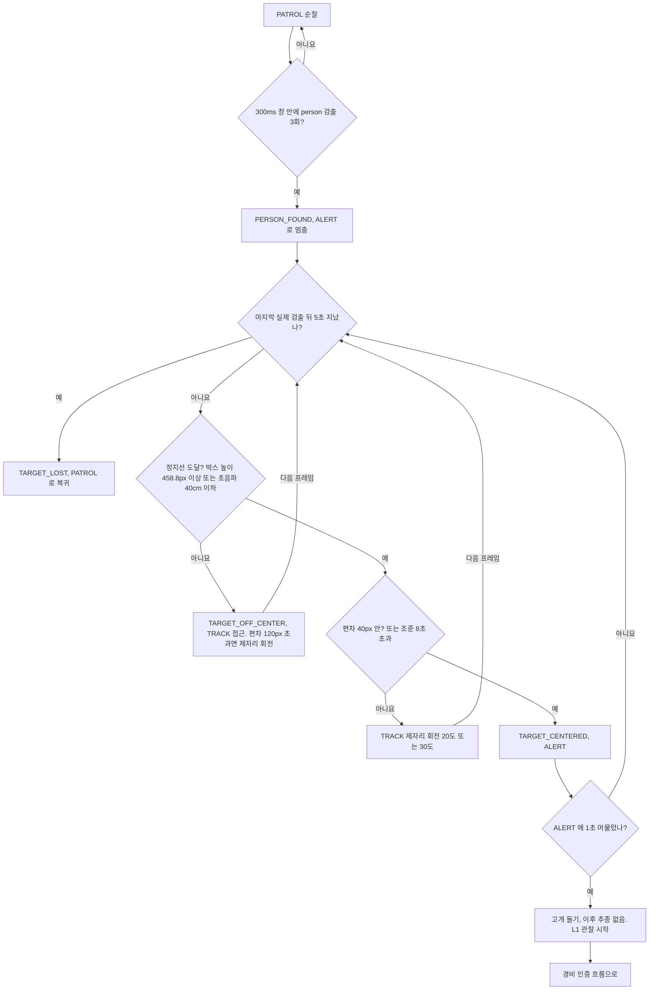
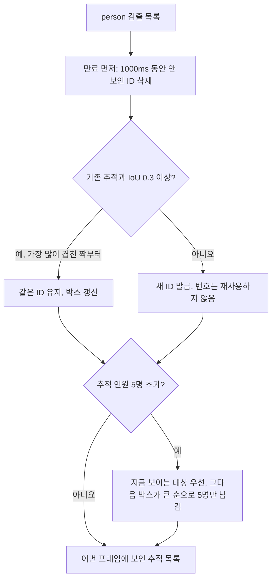

# 사람 확인·추적

한 프레임짜리 오검출로 로봇이 멈추지 않게 하고, 사람이 실제로 있으면 그 앞까지 가서 정면을 맞춘 뒤 고개를 든다.
사람 확정은 고정 시간 창 안의 검출 횟수로 한다. 추종은 가장 점수가 높은 사람 박스의 가로 편차, 박스 높이, 초음파 거리로 정한다.
이 문서는 경비 모드의 흐름이다. 공장 모드와 다른 점은 «실패·예외 시 동작»에 적는다.

## 판단 흐름

### 확인에서 고개 들기까지 (경비 모드)

L1 이후는 [경비 모드 인증](guard-auth.md)과 [대응 에스컬레이션](escalation.md)에 있다.

### 추적 ID 붙이기 (프레임마다)

추적 ID 는 인증 세션(설정으로 켰을 때), 공장 모드의 PPE 판정 대상, 쓰러짐 판정의 대상 구분에 쓰인다.
위의 추종 흐름은 추적 ID 가 아니라 사람 게이트가 고른 대표 박스(가장 점수가 높은 사람)를 따른다.

## 판단 기준

| 조건 | 값 | 설정 키 | 근거 |
| :--- | :--- | :--- | :--- |
| 사람 확정 시간 창 | 300ms | `vision.detect_window_ms` | [ADR-25](../DECISIONS.md#adr-25) |
| 창 안 필요 검출 수 (연속이 아니어도 됨) | 3회 | `vision.detect_hits_required` | [ADR-25](../DECISIONS.md#adr-25) |
| 확정 해제 | 창 안 검출이 0회가 될 때 | — | [ADR-25](../DECISIONS.md#adr-25) |
| 대상 상실 | 마지막 실제 검출 뒤 5초 | `fsm.target_lost_timeout_s` | [ADR-26](../DECISIONS.md#adr-26) |
| 추적 결합 임계 | IoU 0.3 | `vision.tracker.iou_match_threshold` | [ADR-27](../DECISIONS.md#adr-27) |
| 추적 ID 소실 버퍼 | 1000ms | `vision.tracker.track_lost_ms` | [ADR-27](../DECISIONS.md#adr-27) |
| 동시 추적 상한 | 5명 | `vision.max_tracked_persons` | [ADR-27](../DECISIONS.md#adr-27) |
| 조향 데드존 | 40px (중앙에 든 뒤에는 120px 까지 유지) | `fsm.track_deadzone_px` | [ADR-40](../DECISIONS.md#adr-40) |
| 제자리 회전 분기점 | 편차 120px | `fsm.track_turn_split_px` | [ADR-40](../DECISIONS.md#adr-40) |
| 제자리 회전각 | 20도 (120px 이하) / 30도 (초과) | `fsm.track_turn_small_deg` · `fsm.track_turn_large_deg` | [ADR-40](../DECISIONS.md#adr-40) |
| 정지선: 박스 높이 | 310px × 1.48 | `fsm.track_target_height_px` · `fsm.track_stop_ratio` | [ADR-40](../DECISIONS.md#adr-40) |
| 정지선: 초음파 거리 | 40cm 이하 | `fsm.track_stop_dist_cm` | [ADR-40](../DECISIONS.md#adr-40) |
| 조준 상한 | 정지선 도달 뒤 8000ms | `fsm.track_aim_timeout_ms` | [ADR-40](../DECISIONS.md#adr-40) |
| 고개 들기 전 ALERT 체류 | 1000ms | `posture.alert_hold_ms` | [ADR-40](../DECISIONS.md#adr-40) |

## 실패·예외 시 동작

- 관측 공백이 300ms 창보다 길면(스트림 재연결) 창을 비우고 새로 센다. 이전 검출로 곧바로 다시 확정하지 않는다.
- 확정이 풀리는 것(창이 빔)과 대상 상실(5초)은 다른 사건이다. 확정이 풀려도 5초가 지나기 전에는 `ALERT`·`TRACK` 에 머문다.
- 고개를 든 뒤에는 대상이 옆으로 움직여도 다시 쫓지 않는다. 대상이 떠나면 5초 상실로 순찰에 돌아간다.
- 박스가 없는 프레임에서는 추종 사건을 내지 않는다. 마지막 추종 지시는 `fsm.track_coast_ms`(1000ms)까지만 이어 가고 그 뒤에는 멈춘다.
- 데드존이 화면 반폭 이상인 잘못된 설정이면 그 프레임의 추종을 버리고 오류를 한 번 기록한다. 순찰 루프는 계속 돈다.
- 대기(`IDLE`)·수동(`MANUAL`)에서는 사람을 확정해도 대응 단계를 올리지 않는다. 대기에서 순찰로 들어갈 때 게이트 엣지를 다시 장전하므로, 이미 앞에 서 있던 사람도 `PERSON_FOUND` 가 된다.
- 공장 모드는 사람을 확정하면 `ALERT` 로 멈추지만 추종·고개 들기·L1 이 없다. 눈은 파랑(L0)에 머문다. 이어지는 판단은 «PPE 판정 (개발 중)»이며 이 문서의 범위 밖이다. 쓰러짐 의심 중에는 공장 모드도 같은 추종을 쓴다([쓰러짐 확정](factory-fall.md)).

## 코드와 검증

| 분기 | 코드 위치 | 확인하는 테스트 |
| :--- | :--- | :--- |
| 300ms 창 안 3회 확정 | `host/vision/person.py` 의 `PersonGate.observe` | `test_single_detection_is_not_enough` · `test_required_hits_confirm` · `test_hits_may_be_non_contiguous_within_the_window` |
| 창이 완전히 빌 때만 해제 | `host/vision/person.py` 의 `PersonGate.observe` | `test_release_requires_an_empty_window` · `test_release_when_window_empties` |
| 긴 관측 공백 뒤 새 창 | `host/vision/person.py` 의 `PersonGate.observe` | `test_long_observation_gap_starts_a_new_confirmation` |
| 확정 → `PERSON_FOUND` → `ALERT` | `host/runtime.py` 의 `Runtime._poll_vision` | `test_confirmed_person_raises_observe_level` · `test_person_already_in_view_when_patrol_starts_still_reaches_alert` |
| 5초 대상 상실 → `PATROL` | `host/behavior/fsm.py` 의 `Behavior._watch_target` | `test_gate_release_waits_for_target_lost_timeout` · `test_target_lost_after_the_configured_timeout` |
| 정지선 전 편차 → `TRACK`, 120px 초과 제자리 회전 | `host/behavior/track_controller.py` 의 `TrackController.track` · `TrackController._spin_angle` | `test_off_center_person_moves_alert_into_track` · `test_far_person_beyond_split_spins_before_walking` |
| 정지선: 박스 높이 | `host/behavior/track_controller.py` 의 `TrackController.track` | `test_close_off_center_person_spins_to_center_before_pitch` · `test_without_height_target_centered_person_is_the_stop_line` |
| 정지선: 초음파 40cm | `host/behavior/track_controller.py` 의 `TrackController.track` | `test_ultrasonic_stops_approach_below_box_line` |
| 중앙 유지 히스테리시스 | `host/behavior/track_controller.py` 의 `TrackController.track` | `test_centered_target_is_held_through_detection_jitter` |
| 조준 8초 상한 | `host/behavior/track_controller.py` 의 `TrackController.track` | `test_aim_timeout_raises_the_head_for_a_dodging_target` |
| ALERT 1초 체류 뒤 고개 들기 | `host/behavior/actions.py` 의 `PostureSequence` · `host/runtime.py` 의 `Runtime._alert_sequence` | `test_alert_posture_waits_out_the_flapping` · `test_alert_flapping_sends_no_pose_at_all` |
| 고개 든 뒤 추종 없음 | `host/behavior/track_controller.py` 의 `TrackController.track` | `test_engaged_robot_does_not_track_again` |
| 호 추종 조향 계산 | `host/behavior/tracker.py` 의 `LockOnTracker` | `test_target_on_the_right_turns_right_with_a_negative_angle` · `test_target_on_the_left_turns_left_with_a_positive_angle` |
| IoU 결합·ID 유지 | `host/vision/tracker.py` 의 `PersonTracker._associate` | `test_same_person_keeps_the_id_across_frames` · `test_best_overlap_wins_not_the_first_acceptable_one` |
| 소실 버퍼 만료·ID 재사용 금지 | `host/vision/tracker.py` 의 `PersonTracker._expire` · `PersonTracker._open` | `test_short_gap_keeps_the_id` · `test_long_gap_yields_a_new_id` · `test_ids_are_never_reused` |
| 5명 상한 | `host/vision/tracker.py` 의 `PersonTracker._enforce_cap` | `test_capacity_keeps_the_nearest` · `test_a_visible_person_outranks_a_lost_one` |
| 공장 모드는 L1 없음 | `host/runtime.py` 의 `Runtime._poll_vision` | `test_factory_person_keeps_the_eye_blue` |

실측 기록

- [경비 대응 실기: 정지선·제자리 회전·고개 들기](../../TEST_MECHDOG/results/20260923_patrol-engage/summary.md)
- [선회 추종 실기](../../TEST_MECHDOG/results/20260918_3.5.4-track/summary.md)
- [선회 추종 재확인](../../TEST_MECHDOG/results/20260918_3.5.4-recheck/summary.md)
