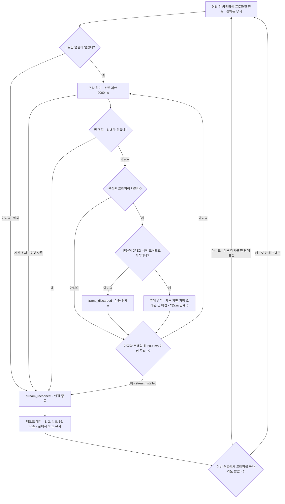
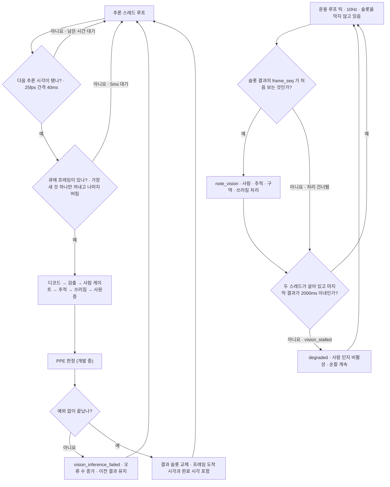

# 카메라 스트림 수신과 추론 워커

카메라(XIAO ESP32S3)의 MJPEG 스트림을 받아 검출 결과를 만들되, 제어 루프가 수신·추론을 기다리지 않게 한다. 스트림이 끊기거나 멈추면 스스로 다시 붙고, 추론이 밀리면 오래된 프레임을 버리고 가장 새 프레임만 본다.
비전이 죽어도 로봇은 페일세이프로 가지 않는다. 사람 인지만 꺼진 채(`degraded`) 순찰을 잇는다.

수신 스레드와 추론 스레드가 따로 돌고, 운용 루프(10Hz)는 결과 슬롯을 막지 않고 읽기만 한다.

## 판단 흐름

### 1. 수신 스레드 (`StreamReader` · `MjpegParser` · `FrameQueue`)

### 2. 추론 스레드와 운용 루프 (`VisionWorker` · `Runtime`)

## 판단 기준

| 조건 | 값 | 설정 키 | 근거 |
| :--- | :--- | :--- | :--- |
| 스트림 멈춤 · 소켓 읽기 제한 | 프레임 없이 2000ms | `vision.stall_timeout_ms` | [링크 안정성 실측](../measurements/2026-09-14-camera-link-stability.md) |
| 재연결 대기 | 1, 2, 4, 8, 16, 30초 · 마지막 값 유지 | `vision.reconnect_backoff_s` | — |
| 대기 단계 초기화 | 프레임을 하나 받았을 때 (연결 성공만으로는 초기화하지 않음) | 없음 | — |
| 프레임 한 장 상한 | 512KB (`Content-Length` 가 넘으면 버리고 재동기) | 없음 (`MAX_FRAME_BYTES`) | — |
| 경계 없이 쌓인 버퍼 상한 | 1MB (넘으면 비움) | 없음 (`MAX_FRAME_BYTES` 의 2배) | — |
| 프레임 큐 깊이 | 2 · 가득 차면 가장 오래된 것 버림 | 없음 (`FrameQueue.capacity`) | — |
| 추론 주기 | 25fps (40ms 간격) · 크게 밀리면 따라잡지 않고 다시 맞춤 | `vision.inference_fps` | [ADR-23](../DECISIONS.md#adr-23) |
| 카메라 전송 상한 | 25fps | `vision.stream_fps_limit` | [카메라 프레임 실측](../measurements/2026-09-14-camera-frame.md) |
| 비전 단절 → `degraded` | 마지막 결과 완료 뒤 2000ms 초과, 또는 첫 결과 없이 워커 시작 뒤 2000ms 초과, 또는 스레드 종료 | `vision.stall_timeout_ms` | — |

## 실패·예외 시 동작

- 연결 실패·소켓 시간 초과·상대 종료·스트림 멈춤은 모두 같은 재연결 경로로 간다. 대기 중에도 `stop()` 을 부르면 곧바로 깨어나 더 연결하지 않는다.
- 연결할 때마다 해상도·프레임률 프로파일과 장착 방향을 카메라에 다시 보낸다. 카메라가 재부팅하면 펌웨어 기본값으로 돌아가기 때문이다. 프로파일 전송이 실패해도 스트림 연결은 계속한다.
- JPEG 표식이 없는 조각, 상한을 넘는 `Content-Length`, 경계를 못 찾은 채 커진 버퍼는 버리고 다음 경계부터 다시 맞춘다. 버린 수는 `ParserStats` 에 남는다.
- 추론이 도착보다 느리면 큐에서 오래된 프레임이 버려진다. 큐는 1초마다 수신·처리·드롭·최대 깊이를 `frame_queue_summary` 로 남긴다.
- 운용 루프는 결과의 나이로 개별 결과를 버리지 않는다. 같은 `frame_seq` 를 두 번 처리하지 않을 뿐이고, 나이는 단절 판정에만 쓴다.
- 추론 중 예외는 스레드를 죽이지 않는다. 오류를 세고 로그를 남긴 뒤 다음 프레임으로 간다. 슬롯에는 이전 결과가 남는다.
- 수신 스레드가 예외로 끝나면 되살리지 않는다. 운용 루프가 `healthy()` 거짓으로 알아채고 `degraded` 를 세운다.
- 검출 세션은 운용 루프가 시작되기 전에 호출 스레드에서 연다. 모델 파일이 없으면 `ModelMissingError` 로 기동을 멈춘다.
- 새 결과가 다시 들어오면 `degraded` 는 풀린다.

## 코드와 검증

| 분기 | 코드 위치 | 확인하는 테스트 |
| :--- | :--- | :--- |
| 연결 전 프로파일 전송 | `host/vision/worker.py` 의 `build_worker` · `host/vision/stream_client.py` 의 `StreamReader._read_once` | `tests/test_stream_client.py::test_profile_hook_runs_before_every_connection` |
| 상대 종료 → 재연결 | `host/vision/stream_client.py` 의 `StreamReader._read_once` · `StreamReader.frames` | `tests/test_stream_client.py::test_read1_eof_reconnects_and_can_use_a_read_only_response` · `tests/test_stream_client.py::test_stream_recovers_and_keeps_yielding` |
| 멈춘 스트림 → 재연결 | `host/vision/stream_client.py` 의 `StreamReader._read_once` | `tests/test_stream_client.py::test_silent_stream_is_treated_as_broken` |
| 백오프 증가 · 포화 · 초기화 | `host/vision/stream_client.py` 의 `StreamReader.frames` | `tests/test_stream_client.py::test_backoff_grows_then_saturates` · `tests/test_stream_client.py::test_backoff_resets_only_after_a_frame` · `tests/test_stream_client.py::test_backoff_resets_when_a_frame_arrives` |
| 정지 시 대기 중단 | `host/vision/stream_client.py` 의 `StreamReader.stop` | `tests/test_stream_client.py::test_stop_wakes_backoff_and_never_opens_another_connection` |
| JPEG 표식 없는 조각 버림 | `host/vision/stream_client.py` 의 `MjpegParser._step` | `tests/test_stream_client.py::test_garbage_between_frames_is_discarded` |
| 상한 초과 재동기 · 버퍼 상한 | `host/vision/stream_client.py` 의 `MjpegParser._resync` · `MjpegParser._guard_overflow` | `tests/test_stream_client.py::test_absurd_content_length_triggers_resync` · `tests/test_stream_client.py::test_buffer_does_not_grow_without_bound` |
| 가득 찬 큐는 오래된 것 버림 | `host/vision/stream_client.py` 의 `FrameQueue.put` | `tests/test_stream_client.py::test_queue_keeps_the_newest_when_full` |
| 가장 새 프레임만 추론 | `host/vision/stream_client.py` 의 `FrameQueue.latest` | `tests/test_stream_client.py::test_latest_drains_the_rest` · `tests/test_vision_worker.py::test_latest_keeps_only_the_newest` |
| 추론 주기 상한 | `host/vision/worker.py` 의 `VisionWorker._infer_loop` | `tests/test_vision_worker.py::test_inference_rate_is_capped` |
| 추론 예외가 스레드를 죽이지 않음 | `host/vision/worker.py` 의 `VisionWorker._run_one` | `tests/test_vision_worker.py::test_inference_exception_does_not_kill_the_thread` · `tests/test_vision_worker.py::test_postprocessing_failure_keeps_old_result_and_recovers` |
| 메인 루프 비차단 | `host/vision/worker.py` 의 `VisionWorker.latest` | `tests/test_vision_worker.py::test_slow_inference_does_not_block_the_caller` · `tests/test_vision_worker.py::test_main_loop_keeps_its_period_under_slow_inference` · `tests/test_vision_worker.py::test_runtime_polls_vision_without_waiting` |
| 세션은 호출 스레드에서 먼저 연다 | `host/vision/worker.py` 의 `VisionWorker.start` | `tests/test_vision_worker.py::test_session_opens_on_the_caller_thread_before_workers_run` |
| 단절 판정 (기동 유예 · 첫 프레임 없음 · 시간 초과) | `host/vision/worker.py` 의 `VisionWorker.stalled` | `tests/test_vision_worker.py::test_stalled_distinguishes_startup_from_disconnect` · `tests/test_vision_worker.py::test_stalled_when_first_frame_never_arrives` · `tests/test_vision_worker.py::test_stalled_after_timeout` |
| 새 `frame_seq` 만 처리 | `host/runtime.py` 의 `Runtime._poll_vision` | 전용 시험 없음 |
| 단절은 `degraded` 이고 순찰은 계속 | `host/runtime.py` 의 `Runtime._poll_vision` · `host/behavior/fsm.py` 의 `Behavior.note_vision_stalled` · `Behavior._watch_links` | `tests/test_fsm.py::test_vision_stall_keeps_patrolling` · `tests/test_fsm.py::test_vision_recovery_clears_the_degraded_flag` |
| 모델 파일 없음 → 기동 중단 | `host/vision/detector.py` 의 `_make_onnx_session` | `tests/test_detector.py::test_missing_model_file_stops_with_the_procedure` |

실측 기록

- [카메라 무선 링크 장시간 안정성](../measurements/2026-09-14-camera-link-stability.md)
- [카메라 장시간 연속 수신](../measurements/2026-09-15-camera-soak.md)
- [카메라 프레임 실측](../measurements/2026-09-14-camera-frame.md)
- [단일 프레임 E2E 사슬](../measurements/2026-09-15-e2e-chain.md)
