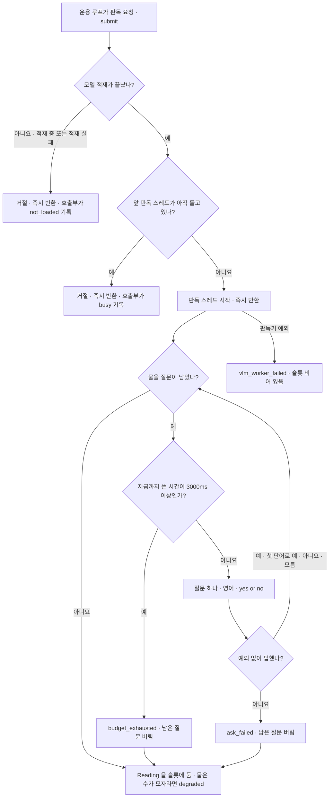
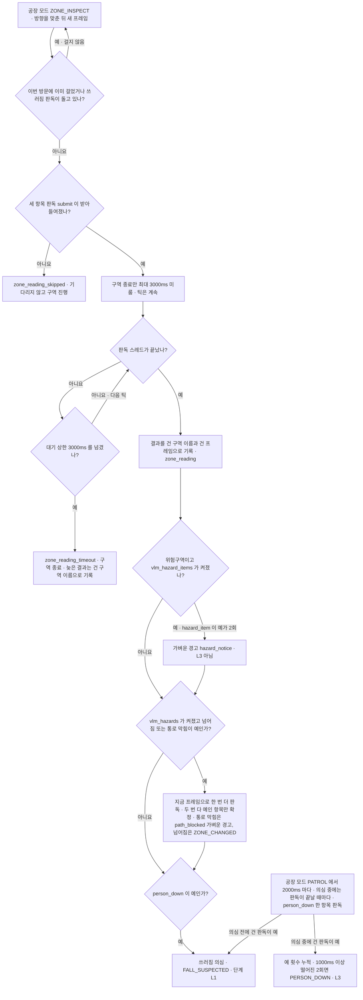

# VLM 단일 장면 판독

카메라 한 장을 로컬 VLM(`Qwen2-VL-2B-Instruct`)에 닫힌 질문으로 물어 «쓰러진 사람» · «넘어진 물건» · «막힌 통로» · «화기 위험물(라이터·보조배터리)» 를 읽는다. 검출기(COCO 80종)로는 말할 수 없는 장면을 보려는 것이다.
판독은 제어 루프 밖 스레드에서 돌고, 모델이 없거나 늦거나 실패해도 주행을 막지 않는다. 판독은 관찰만 돌려주고, 경보를 올릴지는 운용 루프의 규칙이 정한다.

## 판단 흐름

### 1. 판독 요청과 판독 스레드 (`VlmWorker` · `VlmReader`)

### 2. 운용 루프가 결과를 쓰는 곳 (`Runtime`)

`hazard_item` 은 `zones.hazard_ids`(시연은 C) 의 방문에서만 묻는다. 같은 방문 안 서로 다른 프레임의 «예» 2회로 확정하고, 확정은 가벼운 경고(`hazard_notice`)이지 L3 가 아니다([ADR-43](../DECISIONS.md#adr-43)).

구역 판독의 «예» 는 의심에 들게만 하고, 확정 횟수에는 세지 않는다. 확정은 쓰러짐 판독(`F0`)의 «예» 로만 센다.

## 판단 기준

| 조건 | 값 | 설정 키 | 근거 |
| :--- | :--- | :--- | :--- |
| 모델 | `Qwen/Qwen2-VL-2B-Instruct` · bf16 · 기동 때 한 번 적재 | `vision.vlm.model_id` | [ADR-35](../DECISIONS.md#adr-35) |
| 답 길이 상한 | 32 토큰 | `vision.vlm.max_new_tokens` | [ADR-35](../DECISIONS.md#adr-35) |
| 판독 한 번의 예산 | 3000ms (질문 전마다 누적 시간으로 확인) | `vision.vlm.budget_ms` | [VLM 비교 실측](../../field_tests/results/20260920_4.8.0-vlm-compare/summary.md) |
| 구역 종료 대기 상한 | 3000ms | `vision.vlm.budget_ms` | [ADR-35](../DECISIONS.md#adr-35) |
| 동시 판독 | 1건 · 겹치면 거절 (쌓지 않음) | 없음 | [ADR-35](../DECISIONS.md#adr-35) |
| 구역 판독 | 방문당 한 번 · 세 항목 | 없음 | [ADR-35](../DECISIONS.md#adr-35) |
| 순찰 중 쓰러짐 판독 | 공장 모드 `PATROL` 에서 2000ms 마다 · `person_down` 한 항목 | `vision.vlm.patrol_interval_ms` | [ADR-42](../DECISIONS.md#adr-42) |
| 쓰러짐 확정 | 의심 뒤 건 판독의 «예» 2회 · 서로 1000ms 이상 떨어진 프레임 | `fsm.fall_confirm_vlm_yes` · `fsm.fall_confirm_gap_ms` | [ADR-42](../DECISIONS.md#adr-42) |
| 넘어짐 확정 (L3) · 통로 막힘 확정 (가벼운 경고 `path_blocked`) | 같은 방문 안 두 판독이 모두 «예» (기본값은 꺼짐) | `change_detect.vlm_hazards` | [ADR-41](../DECISIONS.md#adr-41) |
| 화기 위험물 질문 | `Is there a lighter or a power bank in this image? Answer with yes or no only.` · 위험구역 방문에서만 | `zones.hazard_ids` | [ADR-43](../DECISIONS.md#adr-43) |
| 화기 위험물 확정 | 같은 방문 안 서로 다른 프레임의 «예» 2회 · 가벼운 경고만 (기본값은 켬) | `change_detect.vlm_hazard_items` | [ADR-43](../DECISIONS.md#adr-43) |
| 답 해석 | 첫 단어가 yes·yeah·yep 이면 예, no·nope·none 이면 아니요, 그 밖은 모름 | 없음 | [ADR-35](../DECISIONS.md#adr-35) |

## 실패·예외 시 동작

- 의존성(`torch`·`transformers`·`torchvision`·`PIL`)이나 `vision.vlm` 설정이 없으면 세션 팩토리가 없다. 판독 요청은 늘 거절되고 나머지 기능은 그대로 돈다.
- 모델 적재는 기동 때 별도 스레드에서 한 번 한다. 적재가 끝나기 전이나 적재가 실패한 뒤 닿은 구역은 `zone_reading_skipped`(`not_loaded`) 를 남기고 지나간다.
- 앞 판독이 돌고 있으면 새 요청은 거절된다. 구역 판독은 방문당 한 번만 시도하므로, 거절된 방문은 기다릴 판독 없이 진행한다.
- 구역 판독과 쓰러짐 판독은 서로 겹치지 않는다. 결과 슬롯이 하나라서, 한쪽이 돌고 있으면 다른 쪽은 걸지 않는다.
- 결과는 판독 스레드가 끝난 뒤에만 가져간다. 가져가면 슬롯이 비워진다.
- 질문 하나가 실패하면(`ask_failed`) 그때까지의 답만 담아 돌려준다. 예산을 넘기면(`budget_exhausted`) 남은 질문을 묻지 않는다. 두 경우 모두 `degraded` 이다.
- 답을 읽지 못하면 그 항목은 «모름» 이고, 원문을 로그와 기록에 남긴다. «모름» 을 «아니요» 로 접지 않는다.
- 저하된 판독은 넘어짐·통로 막힘 확정에 쓰지 않는다. 통로 막힘 확정은 L3 가 아니라 가벼운 경고 `path_blocked`(source `vlm`)이고, 같은 방문에서 넘어짐도 확정되면 `path_blocked` 를 먼저 남기고 L3 로 간다([ADR-41](../DECISIONS.md#adr-41) 개정 2026-10-01). 두 번째 판독이 저하되면 아무것도 확정하지 않고 구역을 끝낸다.
- 구역을 떠난 뒤에 도착한 판독도 건 구역 이름과 건 프레임으로 기록한다. 그 판독의 `person_down` 이 «예» 이면 쓰러짐 의심에 든다.
- 의심 중에 건 쓰러짐 판독이 의심이 끝난 뒤 도착하면 버린다.
- VLM 은 이동 중 길을 정하지 않는다. 질문 하나에 0.2초이고 예·아니요만 돌려주며 위치가 없기 때문이다. 이동 중 막힘은 LiDAR 몫이다([순찰 중 장애물 대응](patrol-obstacle.md)).
- 판독 한 번은 단독으로 L3 를 올리지 않는다. «예» 한 번은 의심(L1)이고, 확정은 의심 뒤 판독 «예» 가 기준 횟수만큼 모여야 한다.
- 종료할 때는 돌고 있는 판독을 최대 2초 기다린 뒤 모델을 내린다. 적재 중이면 내리지 않고 나간다.

## 코드와 검증

| 분기 | 코드 위치 | 확인하는 테스트 |
| :--- | :--- | :--- |
| 요청은 즉시 반환 | `host/vision/vlm_worker.py` 의 `VlmWorker.submit` | `tests/test_vlm_worker.py::test_submit_returns_immediately_even_when_reading_is_slow` |
| 적재 전 요청 거절 | `host/vision/vlm_worker.py` 의 `VlmWorker.submit` | `tests/test_vlm_worker.py::test_submit_is_refused_when_the_reader_is_not_loaded` · `tests/test_runtime.py::test_a_visit_without_a_loaded_reader_passes_and_says_why_once` |
| 판독 중 요청 거절 | `host/vision/vlm_worker.py` 의 `VlmWorker.submit` · `VlmWorker.busy` | `tests/test_vlm_worker.py::test_second_submit_while_busy_is_refused` · `tests/test_runtime.py::test_a_zone_reached_while_the_last_reading_runs_says_busy_and_passes` |
| 판독기 예외 격리 | `host/vision/vlm_worker.py` 의 `VlmWorker._run` | `tests/test_vlm_worker.py::test_reader_that_raises_outright_is_contained` · `tests/test_vlm_worker.py::test_exploding_session_never_reaches_the_caller` |
| 결과는 한 번만 소비 | `host/vision/vlm_worker.py` 의 `VlmWorker.take` | `tests/test_vlm_worker.py::test_take_empties_the_slot` |
| 적재 실패는 예외가 아님 | `host/vision/vlm_reader.py` 의 `VlmReader.load` | `tests/test_vlm_reader.py::test_missing_factory_degrades_instead_of_raising` · `tests/test_vlm_reader.py::test_load_failure_never_raises` |
| 의존성 없으면 팩토리 없음 | `host/vision/vlm_session.py` 의 `build_session_factory` | `tests/test_vlm_session.py::test_factory_is_none_when_a_dependency_is_missing` · `tests/test_vlm_session.py::test_factory_is_none_without_a_vlm_section` |
| 예산 초과 · 질문 실패 · 부분 판독 | `host/vision/vlm_reader.py` 의 `VlmReader.read` | `tests/test_vlm_reader.py::test_budget_stops_further_questions` · `tests/test_vlm_reader.py::test_partial_reading_is_kept_on_failure` |
| 첫 단어로 답 해석 · 모름 유지 | `host/vision/vlm_reader.py` 의 `parse_answer` | `tests/test_vlm_reader.py::test_parses_only_the_leading_token` · `tests/test_vlm_reader.py::test_unknown_is_not_false` · `tests/test_vlm_reader.py::test_unparsed_answer_keeps_the_raw_text` |
| 구역 판독은 방문당 한 번 · 비차단 | `host/behavior/zone_inspector.py` 의 `ZoneInspector._read_scene` | `tests/test_runtime.py::test_the_vlm_is_asked_once_per_visit_not_once_per_cycle` · `tests/test_runtime.py::test_zone_inspection_never_blocks_on_the_vlm` |
| 판독을 기다렸다 구역 종료 · 상한 초과 · 방문이 끊김(확정분만 기록) | `host/behavior/zone_inspector.py` 의 `ZoneInspector._leave` · `ZoneInspector._take_reading` | `tests/test_runtime.py::test_the_robot_waits_for_its_reading_before_leaving_a_zone` · `tests/test_runtime.py::test_a_reading_past_its_budget_lets_go_and_keeps_its_zone_and_frame` · `tests/test_zone_inspector.py::test_a_removal_survives_a_fall_suspicion_read_while_waiting` · `tests/test_zone_inspector.py::test_a_removal_survives_an_external_transition_while_waiting` · `tests/test_zone_inspector.py::test_a_hazard_item_survives_a_reading_that_also_says_person_down` · `tests/test_zone_inspector.py::test_a_reading_that_arrives_after_leaving_confirms_nothing` · `tests/test_zone_inspector.py::test_a_visit_cut_off_mid_collection_keeps_what_it_already_confirmed` · `tests/test_zone_inspector.py::test_a_visit_cut_off_before_any_confirmation_records_nothing` |
| `person_down` → 의심 (구역 · 늦은 결과) | `host/behavior/zone_inspector.py` 의 `ZoneInspector._take_reading` · `host/behavior/fall_monitor.py` 의 `FallMonitor.suspect` | `tests/test_runtime.py::test_a_person_down_reading_at_a_zone_suspects_a_fall_not_an_alarm` · `tests/test_runtime.py::test_a_person_down_reading_that_lands_after_leaving_still_suspects` |
| 넘어짐 (L3) · 통로 막힘 (가벼운 경고) 두 번 판독 확정 | `host/behavior/zone_inspector.py` 의 `ZoneInspector._take_reading` · `ZoneInspector._leave` | `tests/test_runtime.py::test_a_hazard_read_twice_is_confirmed_on_the_first_visit` · `tests/test_runtime.py::test_a_blocked_path_read_twice_is_a_light_notice_not_l3` · `tests/test_zone_inspector.py::test_blocked_path_yes_twice_is_one_light_notice` · `tests/test_zone_inspector.py::test_blocked_path_and_fallen_object_leave_the_notice_then_l3` · `tests/test_zone_inspector.py::test_blocked_path_switched_off_never_confirms` · `tests/test_runtime.py::test_a_single_fallen_reading_is_not_confirmed` · `tests/test_runtime.py::test_vlm_hazards_switched_off_never_confirm` · `tests/test_runtime.py::test_an_unusable_second_reading_confirms_nothing_and_lets_go` · `tests/test_runtime.py::test_a_late_reading_from_the_last_visit_does_not_count` |
| 순찰 중 쓰러짐 판독 주기 | `host/behavior/fall_monitor.py` 의 `FallMonitor.ask` | `tests/test_runtime.py::test_a_patrol_reading_asks_only_person_down_every_interval` |
| 쓰러짐 판독 결과 → 의심 · 확정 | `host/behavior/fall_monitor.py` 의 `FallMonitor.take_reading` · `FallMonitor._confirm` | `tests/test_runtime.py::test_a_reading_alone_suspects_and_its_entry_answer_does_not_count` · `tests/test_runtime.py::test_a_fall_is_confirmed_by_readings_a_gap_apart` · `tests/test_runtime.py::test_a_no_between_readings_does_not_reset_the_count` |
| 위험구역에서만 `hazard_item` · 두 번 «예» → `hazard_notice` | `host/behavior/zone_inspector.py` 의 `ZoneInspector._keys` · `ZoneInspector._leave` · `host/vision/vlm_reader.py` 의 `QUESTIONS` | `tests/test_zone_inspector.py::test_hazard_item_yes_twice_is_one_light_notice` · `tests/test_zone_inspector.py::test_hazard_item_yes_then_no_confirms_nothing` · `tests/test_zone_inspector.py::test_a_degraded_second_reading_confirms_no_hazard_item` · `tests/test_zone_inspector.py::test_hazard_items_switched_off_never_confirm` · `tests/test_zone_inspector.py::test_a_plain_zone_never_asks_for_hazard_items` · `tests/test_zone_inspector.py::test_l3_and_hazard_item_in_one_visit_leave_both` · `tests/test_situation.py::test_hazard_notice_with_zone` |
| VLM 없이도 구역 점검 동작 | `host/behavior/zone_inspector.py` 의 `ZoneInspector.inspect` | `tests/test_runtime.py::test_zone_inspection_runs_without_any_vlm` |

실측 기록

- [VLM 판독 카메라 벤치](../../field_tests/results/20260928_4.8.0-vlm-bench/summary.md)
- [두 장 비교 가능성 · 질문당 지연](../../field_tests/results/20260920_4.8.0-vlm-compare/summary.md)
